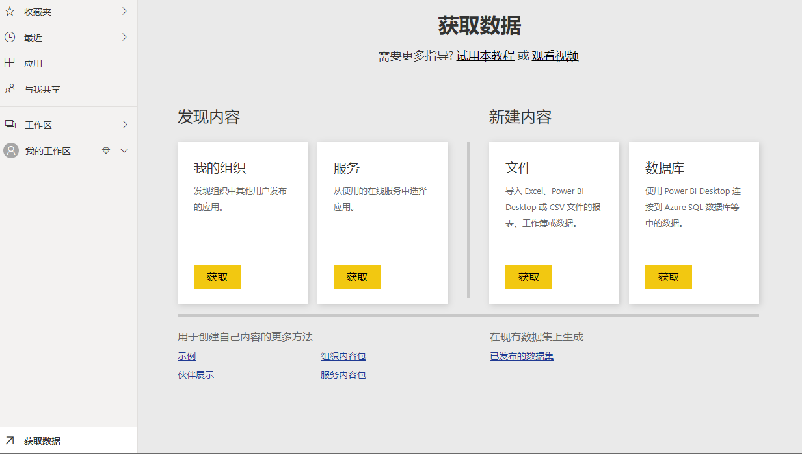

# Power BI基础入门

## 预备知识

### 使用Power BI创建丰富的交互式报告  

2019年2月，微软被评为Gartner Magic Quadrant中数据分析和商业智能的领导者，这已经是微软连续第12年获得此殊荣。并且在过去五年中，由于Power BI，微软在分析和商业智能领域取得了辉煌的地位。 Power BI是一组功能强大的工具，旨在让终端用户轻松接入这些工具，这些工具允许您创建可视化效果，以便操作、发布和与同事共享。 学习 Power BI比尝试使用那些操作困难、功能较差、协作性较低的工具分析数据的人员更具有优势。

### 学习前的准备

#### 硬件要求  

* 可用内存：1.5GB或者更高(不能小于1GB)  
实际上对内存的要求没有上限，尤其是当你需要处理海量数据的时候，内存越大越好，Power BI软件本身，当你一打开并且只是使用少量数据的时候，就会占用1.5GB的内存。如果你的数据达到几十万上百万，低内存会让你整个无法操作，那是一种可怕的体验。我现在使用32GB的内存，但是仍然不足以让Power BI Desktop在处理海量数据使保持流畅。
* CPU：1 Ghz or faster, x64-bit processor  
跟内存一样，没有上限，越高越好  
* Display：1440×900或者1600×900  
Power BI作为数据可视化工具，需要面对可视化视图，页面设计，当你的屏幕小，分辨率小的时候，你会感觉你的画布不够用，设计出一些在实际使用中，正常分辨率看上去过大的图形。  
* 显示器文本显示设置：100%或者低一些  
很多人因为显示器分辨率高，特意把系统字体设置成125%或者150%，这会影响Power BI页面的正常效果显示  

!> 如果你是专业数据工作者，需要面对百万千万级的数据，你可能需要一台高内存，高性能的工作站  

#### 软件要求  

* Windows 7/10或者Windows server 2008  
* .NET 4.5
* 最新版本的浏览器，如果IE，Edge，谷歌，火狐  
* Power BI Pro或者Power BI Service  
Power BI Service的基础功能是免费的，但是如果你想发布你的报告，并通过网页把你的报告分享给别人看，那么你需要使用Power BI Pro服务，该服务是按月付费的服务，该服务允许试用60天  
[Power BI pricing](https://powerbi.microsoft.com/en-us/pricing/)  
* Power BI Desktop  
Power BI Desktop是Power BI的免费桌面版软件，在你报告完成并发布前，你需要使用这个软件对数据进行清洗、转换、可视化，对于报告制作者来说，这个软件是你跟数据直接对接的最有效方案  

#### 数据技术要求

Power BI的核心是将数据可视化并且与他人分享报告，但是在制作过程中，需要对数据进行处理，所以这需要一定的数据处理基础，但是初级的要求其实很低，如果你有使用excel，在入门阶段，你只要知道以下操作，就可以完成这一章节的学习：  

* 输入，编辑，格式化文本和数字
* 使用表格的一些函数  
* 查找，替换
* 排序，筛选
* 插入和格式化图标  
如果你对以上内容都不熟悉，建议先补习一下  

## 入门指南  

### 概述：Power BI相关的概念  

#### Business Intelligence - 商业智能  

商业智能通常指将业务决策与有关业务及其环境的事实联系起来，深入研究并理解业务后面的数据，以便做出更好的业务决策，它通常包含以下活动：  

* 获取数据  
需要获取与业务相关的所有内部外部数据，并理解相互之间的关联性，理清数据的关联性很重要，整个后续的数据处理都依赖良好的关联性  
* 数据清洗  
很多时候你需要对数据进行清洗，排除干扰数据、垃圾数据，留下有效数据，在这一阶段可能不能完成处理完，在后续阶段，需要再次清洗数据  
* 数据建模  
数据建模是对数据关联性的实际操作，通常会有多个数据模型，多张数据表格，完成数据建模，意味着可以将数据、表格关联性完整地表达清楚  
* 创建可视化  
使用具备关联性的数据进行可视化设计，如图形，表格等等
* 数据清洗  
借助完成的可视化结果，再次对数据进行进一步的清洗  
* 数据分享
与团队分享结果，共同分析，并最终通过这些可视化统计结果，来帮助制定业务决策  

#### Power BI

BI一直是一门大业务，BI的玩家也都是大玩家，比如SAP，Oracle,IBM,Microsoft等等，大型公司创造了真正的大型企业级工具。企业级BI的实现更倾向于IT领域，因此需要IT工作者对业务建立更深的理解，这样才能获取到正确的数据用来创造报告。  
要实现上述内容，最简单，最基础也是最直接的方法，可能是excel。excel有序用户自己使用，进行数据分析，离线操作，excel是非常流行的工具，因为基本上大部分使用电脑的用户都能使用excel，excel是进入自助商业智能的第一步。第一个版本的Power BI，实际上就是基于excel，作为excel的插件存在，实际上Power BI数据处理过程的一部分内容，仍然可以在excel上找到并且使用。  
如今微软在持续演改进Power BI，它已经包含了很多非excel相关的工具，当我们用Power BI进行商业智能分析时，我们通常会做这些：  

* 创建数据集(dataset)  
数据集是一个经过清洗，建模可用于可视化的数据集合，我们需要使用这些数据集来创建报告。  

?> 不要简单地理解dataset中的行与列，Power BI在处理行列时的表现跟excel有很大区别，这非常关键，我们后面会深入讨论它。  

* 报告(report)  
使用数据集来创建报告，一个报告包含多个可视化图形，它可以非常快速地创建各种图形，如漏斗图，树状图，地理空间图等等。  

* 仪表盘(Dashboard)  
使用仪表板可以将多分报告中的可视化图形整合在一个页面。  

#### Power BI的模块

* Power BI Service  
Power BI Service是要给网页服务，对于报告阅读者来说，Power BI Service是核心工具，他们90%的时间可能都是在使用它，通过Power BI Service，可以让用户操作可视化图形，研究数据，阅读报告，对业务数据进行深入理解。

* Power BI Desktop  
如果你是一个数据分析师或者高级用户，你可能会使用Power BI Desktop，一个免费的桌面应用程序，用来进行数据处理，数据建模，创建可视化报告，然后发布到Power BI Service  

* Power BI Visuals Marketplace  
Power BI除了自身拥有的多种可视化图形，也支持开发者开发可视化图形，并发布到应用商店，称为自定义可视化，报告创建者可以进入应用商店找需要的可视化图形进行报告制作  

* Power BI Mobile Apps  

* Power BI Gateway  
用于连接Power BI和企业数据，你的报告能够始终保持最新的数据情况，是Power BI Service通过Power BI Gateway，连接源数据，并进行定期的同步  

* Power BI Embedded  

* Power BI Report Server  

### 注册Power BI  

你可以访问[Power BI 官网](https://powerbi.microsoft.com/)来进行注册试用。进入首页后,可以直接选择`免费试用`申请60天的免费试用，他会要求你输入工作邮件，工作邮箱是一些比如公司域名，或者edu结尾之类的邮箱，如果你输入类似@live.cn， @gmail.com， @foxmail.com这种明显的个人邮箱地址，将无法申请试用。  
  
我们可以通过另外一种方法绕过这个验证,方法是你可以使用你的普通邮箱账号先去申请office365的免费试用,通过office365服务,可以直接进入Power BI服务  
如果你的邮箱已经注册了Power BI服务,那么直接点击就会转到Power BI服务页面
?> Power BI主要用途是发布和分享你的报告,这章后面会简单介绍在Power BI服务上创建报表,但是推荐的方案还是在Power BI Desktop上完成报表创建  

### 获取数据  

#### Power BI服务 - 数据源介绍  

在Power BI服务页面,我们可以通过点击获取数据来使用多种方式去连接数据源  
  

1. 我的组织  
