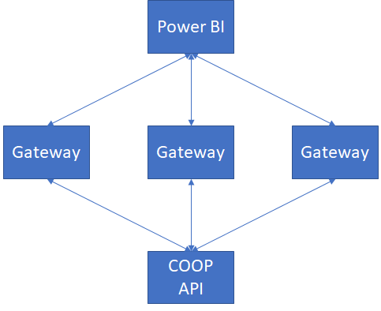
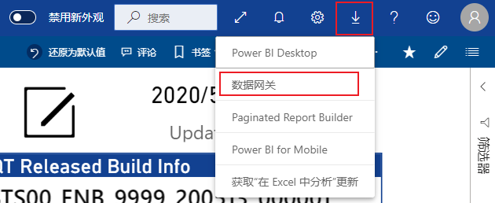
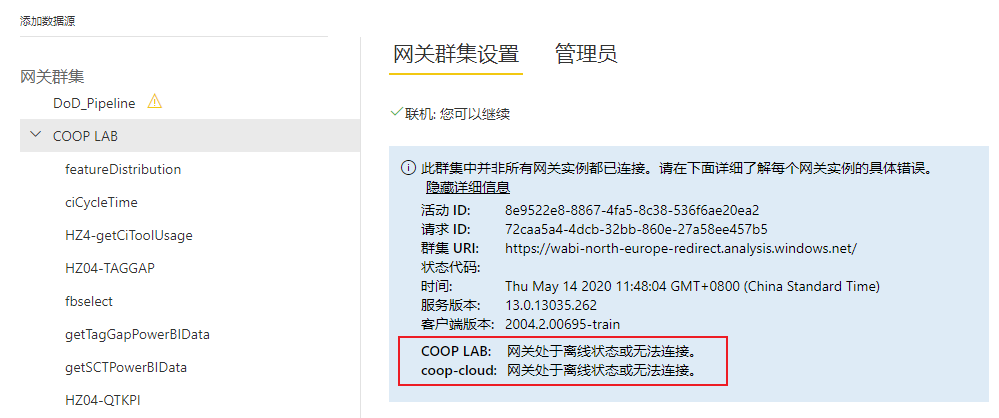
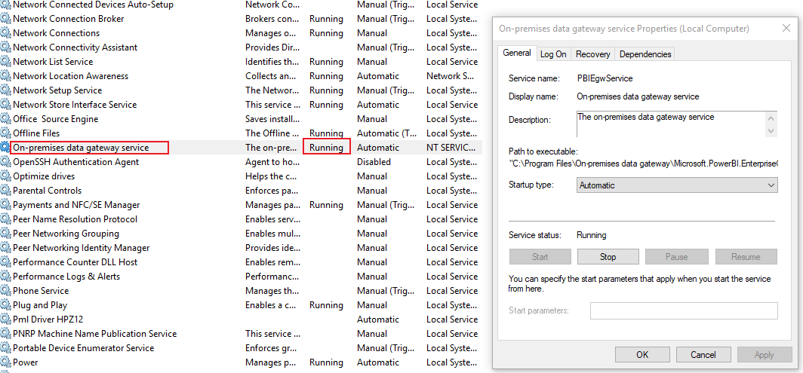

# 工作实践

## 维护相关  

### 本地调试方案

Power BI Desktop在处理数据时,消耗的当前运行程序服务器的资源,主要消耗的资源是CPU和内存,在实践的过程中发现,当数据达到几十万并且处理逻辑比较复杂的时候,只要一点刷新,CPU和内存必然全部耗尽,最终会使得程序崩溃。  
由于我们使用的是web API的方式从COOP数据库获取数据，API格式是固定的，如果每次给每个API加参数使其获得少量数据，然后再一个一个改回去，太浪费时间。因此我设计了当前调试方案来满足灵活的本地调试需求。  

* 首先需要知道的是，针对Power BI，COOP使用的是固定服务器来提供数据，HZ04，所以Online的数据API都是以HZ04的域开头的：  

```http
http://hzcoop04.china.nsn-net.net:3001
```

当我们需要调试的时候,需要将online域改成testcoop的域  

```http
http://testcoop.china.nsn-net.net:3000
```

HZ04的服务器信息:  
地址: 10.159.111.218  
用户名: hzcoop_user  
密码:  

testcoop的服务器信息:  
地址: 10.159.218.18  
用户名: root  
密码:  

?> 调试之前记得把部分数据从COOP数据库复制到testcoop数据库  

### 网关维护方案

网关是保证Power BI数据可以和COOP数据连接的重要组件,当Power BI文件发布到Power BI服务上后,实际上他是运行与外网,微软的云服务,而COOP服务在内网。  
Power BI服务上需要经常对数据集进行更新，触发更新后就会使用配置的API访问数据，很明显COOP的数据外网无法访问。  
所以这时候就需要网关，网关假设在一台可以同时连接Power BI服务和本地数据的服务器上，当网关服务打开时，Power BI服务就可以通过网关获取内网数据，再通过网关发给Power BI。  
你可以设置集群，比如在多台服务器上都搭建网关，把这些网关加入到同一个集群中，那么Power BI服务就可以通过优先级，访问集群中的网关进行数据更新，当一台网关掉线时，其他网关也可以继续使用。  
  

#### 网关安装  

可以在Power BI页面直接下载网关，下载标准版，而不是个人版，个人版无法加入集群  
  

安装的时候选择加入现有集群，集群名字叫COOP LAB，秘钥是coopcoop  

#### 配置网关代理  

如果你的电脑是实验室的网络,那在没有代理的情况下是无法访问外网,并且外网也无法访问的,所以当你在这台服务器上配置了网关后,网关本身仍然无法连接Power BI服务。  
所以我们需要对网关进行代理配置,可以参考官网配置方式进行配置。  
[为本地数据网关配置代理设置](https://docs.microsoft.com/zh-cn/data-integration/gateway/service-gateway-proxy)  

#### 判断网关是否在线  

在网关管理界面  
  
可以查看集群下的网关实体是否在线  
  
如果发现不在线，可以尝试在对应服务器打开网关软件看看状态，如果网关无法运行，查看windows系统服务里的on-premises data gateway service是否处于running状态  
  

## 