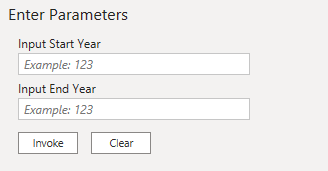

# M语言典型案例

## 时间相关  

### 创建日期列表  

需求:生成某一年的所有日期列表,并新增列将每个日期对应的周,月,季度,年份,年月等逐一列出。

解题思路：  
假设生成2019年的所有日子，那么第一天是2019-01-01，最后一天是2019-12-31，于是有了初始的列表{"2019-01-01", "2019-12-31"}, 接下来要做的就是以2019-01-01为基础,日期+1,+2,+3.....每加一天生成一个日期,直到2019-12-31  
就可以得到列表{"2019-01-01", "2019-01-02", "2019-01-03", ......., "2019-12-31"}  
得到日期列表后,再对每一个日期通过date相关函数直接得出对应日期的年,季度,月,周等结果  

解题过程:  

* 定义开始和结束日期  

```M
startDate = #date(2019,1,1)
endDate = #date(2019,12,31)
```  

!> 创建日期公式#date(year as number, month as number, day as number) as date  
创建时间公式#datetime(year as number, month as number, day as number, hour as number, minute as number, second as number) as any  
创建带时区时间公式#datetimezone(year as number, month as number, day as number, hour as number, minute as number, second as number, offsetHours as number, offsetMinutes as number) as any  
创建间隔时间公式#duration(days as number, hours as number, minutes as number, seconds as number) as duration  

* 生成日期序号序列  

```M
dateNumberList = {1..Number.From(end_date)-Number.From(begin_date)+1}  
// Number.From(end_date)-Number.From(begin_date) 为 43466 - 43830 = 364
// 得到的结果是{1,2,3,4,......,365}  
```  

!> Number.From(value as any, optional culture as nullable text) as nullable number  
可以将各种类型的值转换成number类型的值, 当输入是date的时候,会转换成OLE数值  
OLE时间是用double类型来表示的，整数部分是自1900年至今流逝的天数包含闰年计算，而小数部分不足一天流逝的总秒数。  
"..."用于生成列表序列, 如{1..5},得到{1,2,3,4,5}

* 生成日期序列  

```M
dateList = List.Transform( dateNumberList , (item)=> Date.AddDays(startDate,item-1))  
{2019-01-01,2019-01-02, .. , 2019-12-31}
```  

!> List.Transform(list as list, transform as function) as list  
将列表以一定的计算方式转换成新的列表  
".."值对有序number值有效,所以直接对日期使用..没有用  

* 将日期列表转成表格  

如果通过界面直接点击转换,会自动产生代码  

```M
#"Converted to Table" = Table.FromList(dateList, Splitter.SplitByNothing(), null, null, ExtraValues.Error),
#"Renamed Columns" = Table.RenameColumns(#"Converted to Table",{{"Column1", "date"}}),
#"Changed Type" = Table.TransformColumnTypes(#"Renamed Columns",{{"date", type date}})
```

你也可以通过将这些代码组合嵌套直接写成一行  

```M
dateTable = Table.TransformColumnTypes(Table.RenameColumns(Table.FromList(dateList, Splitter.SplitByNothing(), null, null, ExtraValues.Error),{{"Column1", "date"}}),{{"date", type date}})
```  

!> M系统的类型概念很重要,所有的内置函数也都是按类型来分的,所以当你要找一个函数的时候,先确定你要生成的值的类型,然后在对应类型的函数库里找对应的函数  

* 生成年/季度/月/周等信息  

年/季度/月/周属于date类型,所以在date函数库里很快发现对应的公式  
Date.Year Date.QuarterOfYear Date.Month Date.WeekOfYear  
只需要将公式结果添加为新的列即可  

```M
//Table.AddColumn(table as table, newColumnName as text, columnGenerator as function, optional columnType as nullable type) as table
//Date.Year(dateTime as any) as nullable number
year = Table.AddColumn(dateTable, "Year", each Date.Year([date]), type number),
quarter = Table.AddColumn(year, "Quarter", each Date.QuarterOfYear([date]), type number),
month = Table.AddColumn(quarter, "Month", each Date.Month([date]), type number),
week = Table.AddColumn(month, "Week", each Date.WeekOfYear([date]), type number)
```

* 最终结果  

完整代码

```M
let
    startDate = #date(2019,1,1),
    endDate = #date(2019,12,31),
    dateNumberList = {1..Number.From(endDate)-Number.From(startDate)+1},
    dateList = List.Transform( dateNumberList , (item)=> Date.AddDays(startDate,item-1)),
    dateTable = Table.TransformColumnTypes(Table.RenameColumns(Table.FromList(dateList, Splitter.SplitByNothing(), null, null, ExtraValues.Error),{{"Column1", "date"}}),{{"date", type date}}),
    year = Table.AddColumn(dateTable, "Year", each Date.Year([date]), type number),
    quarter = Table.AddColumn(year, "Quarter", each Date.QuarterOfYear([date]), type number),
    month = Table.AddColumn(quarter, "Month", each Date.Month([date]), type number),
    week = Table.AddColumn(month, "Week", each Date.WeekOfYear([date]), type number)
in
    week
```  

生成数据  

| date       | Year | Quarter | Month | Week |
|------------|------|---------|-------|------|
| 2019-01-01 | 2019 | 1       | 1     | 1    |
| 2019-01-02 | 2019 | 1       | 1     | 1    |
| 2019-01-03 | 2019 | 1       | 1     | 1    |
| 2019-01-04 | 2019 | 1       | 1     | 1    |
| 2019-01-05 | 2019 | 1       | 1     | 1    |
| 2019-01-06 | 2019 | 1       | 1     | 2    |
| 2019-01-07 | 2019 | 1       | 1     | 2    |
| 2019-01-08 | 2019 | 1       | 1     | 2    |
| 2019-01-09 | 2019 | 1       | 1     | 2    |
| 2019-01-10 | 2019 | 1       | 1     | 2    |
| 2019-01-11 | 2019 | 1       | 1     | 2    |
| 2019-01-12 | 2019 | 1       | 1     | 2    |
| 2019-01-13 | 2019 | 1       | 1     | 3    |
| 2019-01-14 | 2019 | 1       | 1     | 3    |
| 2019-01-15 | 2019 | 1       | 1     | 3    |
| 2019-01-16 | 2019 | 1       | 1     | 3    |
| 2019-01-17 | 2019 | 1       | 1     | 3    |
| 2019-01-18 | 2019 | 1       | 1     | 3    |
| 2019-01-19 | 2019 | 1       | 1     | 3    |
| 2019-01-20 | 2019 | 1       | 1     | 4    |
| 2019-01-21 | 2019 | 1       | 1     | 4    |
| 2019-01-22 | 2019 | 1       | 1     | 4    |
| 2019-01-23 | 2019 | 1       | 1     | 4    |
.......

#### 创建日期表的演进  

1. 优化季度月份星期的显示
    通常我们显示的时候,比如显示季度,月份,周一般会去这样展示2019Q1, 2019M1, 2019W1, 比直接显示1,1,1可读性更高.  
    所以这里用到了文本处理,将季度前面加了year和Q,月份前加了year和M,周前加了year和W  

    ```M
    //Table.AddColumn(table as table, newColumnName as text, columnGenerator as function, optional columnType as nullable type) as table
    quarterName = Table.AddColumn(week, "Quarter Name", each Text.From([Year])&"Q"&Text.From([Quarter])),
    monthName = Table.AddColumn(quarterName, "Month Name", each Text.From([Year])&"M"&Text.From([Month])),
    weekName = Table.AddColumn(monthName, "Week Name", each Text.From([Year])&"W"&Text.From([Week]))
    ```

2. 根据输入的开始和结束日期计算表  

    我们可以将上面的内容制作成函数,以便随时得到想要的范围内的日期  

    ```M
    (#"Input Start Year" as number, #"Input End Year" as number) => let
        startDate = #date(#"Input Start Year",1,1),
        endDate = #date(#"Input End Year",12,31),
        dateNumberList = {1..Number.From(endDate)-Number.From(startDate)+1},
        dateList = List.Transform( dateNumberList , (item)=> Date.AddDays(startDate,item-1)),
        dateTable = Table.TransformColumnTypes(Table.RenameColumns(Table.FromList(dateList, Splitter.SplitByNothing(), null, null, ExtraValues.Error),{{"Column1", "date"}}),{{"date", type date}}),
        year = Table.AddColumn(dateTable, "Year", each Date.Year([date]), type number),
        quarter = Table.AddColumn(year, "Quarter", each Date.QuarterOfYear([date]), type number),
        month = Table.AddColumn(quarter, "Month", each Date.Month([date]), type number),
        week = Table.AddColumn(month, "Week", each Date.WeekOfYear([date]), type number),
        quarterName = Table.AddColumn(week, "Quarter Name", each Text.From([Year])&"Q"&Text.From([Quarter])),
        monthName = Table.AddColumn(quarterName, "Month Name", each Text.From([Year])&"M"&Text.From([Month])),
        weekName = Table.AddColumn(monthName, "Week Name", each Text.From([Year])&"W"&Text.From([Week]))
    in
        weekName
    ```

      

    输入起止年份,就可以得到对应的日期列表了  

### Unix Time转

```JSON
= #datetime(1970, 1, 1, 0, 0, 0) + #duration(0, 0, 0, [unixtime])
```