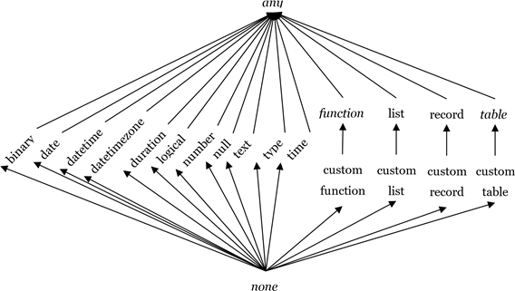

# M语言基础

## 写在前面

这一章节的内容完全来自于官方文档，官方的中文文档不太好，我看得很费劲，所以直接看的英文文档，看完后优化了官方中文文档，有些地方加了一些自己的备注。建议有能力直接看官方的英文文档。  

## 简单介绍

### 概述

Microsoft Power Query包含了许多强大的功能,来增强“数据获取”上的体验。它的核心功能是筛选和合并，也称为“mash-up”（混聚），即可以从多种类型的数据源中，提取一个或多个数据合集，并将他们混合汇聚，转换成统一格式，可供后续流程使用的数据。整个数据的的mashup过程，都使用了Power Query 公式语言（通常也称为“M”）。 Power Query 在 Excel 和 Power BI 中嵌入 M 文档，以完成数据的自动化可重复mashup。  
  
本文将介绍 M 语言的规范。我们会通过以下渐进式的步骤逐一介绍每一个块内容：  

1. 词法结构（lexical structure）：词法结构定义了一套在词法上有效的文本。  
2. 基础结构的基本概念:值,表达式,环境,变量,标识符,计算模型。  
3. 值（包括基元值和结构化值）的详细规范,这种规范也定义了语言的目标域。  
4. 类型：值具有类型，而类型本身也是一种特殊的值，他们构成了各种值的基本原理并且他们本身携带的元数据信息又可以指明结构化值的形态。  
5. 运算符: M语言中的运算符决定了可以形成哪种形式的表达式。
6. 错误: 运算法或者函数,在表达式的计算过程中，可能会出现错误。虽然错误不是值，但可以通过多种方法将错误映射回值来处理错误。
7. Let: let表达式可以引入辅助定义，以便在更小的步骤中生成复杂的表达式。
8. 函数: 另一种特殊值，为 M 提供丰富标准库的基础，并允许添加新抽象 。
9. 条件语句: 表达式支持条件计算。
10. 分区： 节提供简单的模块化机制 。 （Power Query 尚未使用节。）
11. 合并语法：  

在本章中会简单地介绍以下各个部分的概念以便帮助大家有一个直观的任何和了解，在之后的章节中会更加具体地介绍每块内容。  
如果你是一位经验丰富的程序语言使用者，那么你可以把M语言理解成一种纯粹、高阶、动态类型、部分惰性的函数式编程语言。“the formula language specified in this document is a mostly pure, higher-order, dynamically typed, partially lazy functional language.”  

### 表达式和值  

M语言的核心结构是表达式。通过一个可计算的表达式，来产生一个值。  
尽管许多值都可以按字面形式写成表达式，但值不是表达式。例如，表达式 1 的计算结果为值 1；表达式 1+1 的计算结果为值 2。这个区别非常微妙，但是很重要。表达式是计算的方法；值是计算的结果。  
下面的示例演示了 M 中可用的不同类型的值。通常，使用字面意思直接编写的值，他们可以作为表达式使用，表达式的计算结果就是它本身。 （请注意，// 指示注释的开头，注释延续至行尾。）  

* 原始值（primitive value）是一个单一的值，比如数字，逻辑值，文本或者null。null用来表明数据不存在  

````M
123                  // A number
true                 // A logical
"abc"                // A text
null                 // null value
````

* 列表（list）值是值的有序序列 。 M 支持无限列表，但如果写入的是文本，则列表具有固定长度。 花括号 { 和 } 表示列表的开头和结尾。  

````M
{123, true, "A"}     // list containing a number, a logical, and a text 
{1, 2, 3}            // list of three numbers
````

* 记录（record）是一组字段。字段是名称/值对，其中名称是在字段的记录中唯一的文本值。记录值的文本语法允许将名称写成不带引号的形式，这种形式也称为“标识符”(identifiers)。下面显示了一个记录，其中包含名为 A、B和 C 的三个字段，这些字段具有值 1、2 和 3。  

````M
[
      A = 1,  
      B = 2,  
      C = 3
]
````

* 表(table)是一组按列（按名称标识）和行组织的值。没有用于创建表的字面量语法，但有几个标准函数可用于从列表或记录创建表。  

````M
#table( {"A", "B"}, { {1, 2}, {3, 4} } )
````

这将创建一个形状如下所示的表：  

A | B
--|--
1 | 2
3 | 4
5 | 6

* 函数（function）是一个值，当带着参数进行调用时，将生成一个新值。函数编写的方法是在括号中列出函数的“参数”，后跟箭头符号 => 和定义函数的表达式。该表达式通常引用参数（按参数名称引用）。  

````M
(x, y) => (x + y) / 2
````

### 计算(Evaluation)  

在电子表格中，计算的先后顺序是根据单元格中公式的依赖关系来决定的，而M语言的计算模型就是根据表格中的这种计算模型演化而来。  
如果你有excel表格的公式编辑经验，你可能会意识到左侧的公式在计算时会生成右侧的值：  
  
  
在M语言中,表达式中的各个部分都可以通过名字来引用表达式的其他部分，整个计算过程将会根据被引用的表达式的计算结果自动决定计算顺序。  
  
我们可以使用一个记录来生成一个与上述电子表格示例等效的表达式。 初始化字段的值时，可以通过使用字段名称引用记录中的其他字段，如下所示：  

````M
[  
    A1 = A2 * 2,  
    A2 = A3 + 1,  
    A3 = 1  
]
````  

上述表达式等效于以下表达式（因为两者都计算出相等的值）：  

````M
[  
    A1 = 4,  
    A2 = 2,  
    A3 = 1  
]
````  

记录可以包含在其他记录中，也可以嵌套在其他记录中 。 我们可以使用“查找运算符” ([]) 按名称访问记录的字段。 例如，以下记录具有一个名为 Sales 的字段（包含一个记录）和一个名为 Total 的字段（用于访问 Sales 记录的 FirstHalf 和 SecondHalf 字段）：  

```M
[  
    Sales = [ FirstHalf = 1000, SecondHalf = 1100 ],
    Total = Sales[FirstHalf] + Sales[SecondHalf]
]
```
  
计算后，上述表达式等效于以下表达式：  

```M
[  
    Sales = [ FirstHalf = 1000, SecondHalf = 1100 ],
    Total = 2100
]
```  

!> 记录是一组key/value组合,我们通过记录的名称和key来找到对应的值  

记录也可以包含在列表中。 我们可以使用“位置索引运算符” ({}) 按其数字索引访问列表中的项目。 从列表的开头开始，使用从零开始的索引来引用列表中的值。 例如，索引 0 和 1 用于引用下面列表中的第一和第二项：  

```M
[
    Sales =  
        {  
            [  
                Year = 2007,  
                FirstHalf = 1000,  
                SecondHalf = 1100,
                Total = FirstHalf + SecondHalf // 2100
            ],
            [  
                Year = 2008,  
                FirstHalf = 1200,  
                SecondHalf = 1300,
                Total = FirstHalf + SecondHalf // 2500
            ]  
        },
    TotalSales = Sales{0}[Total] + Sales{1}[Total] // 4600
]
```

!> {}表示列表,要访问列表中的元素使用索引,列表的索引编号是从0开始的,即访问列表的第一个元素,是{0}  

列表和记录中的成员的表达式（以及后面引入的 let 表达式）使用“延迟计算(lazy evaluation)”进行计算，这意味着它们只会根据需要进行计算。所有其他表达式都使用“迫切计算(eager evaluation)”进行计算，这意味着如果在计算过程中遇到它们，则将立即对其进行计算。考虑这一点的一种好方法是记住计算列表或记录表达式将返回一个列表或记录值，该值本身会记住在请求时（查找或索引运算符）需如何计算其列表项或记录字段。  

!> let包裹的内容,以及列表和记录表中表达式,都是延迟计算,在没被调用之前,只是记录了表达式的内容,不会去计算表达式的值,只有在被其他"迫切计算"表达式调用时才会使用表达式去计算值。  
比如let包括的内容只有在使用in的时候会调用计算let里的内容。  

### 函数(Functions)  

在 M 中，函数的做用是将一组输入值映射到单个输出值。 函数的编写方法是，首先命名所需的一组输入值（函数的参数），然后在“转到”(=>) 符号后面提供表达式,该表达式使用这些输入值（函数的主体）来计算函数的结果。 例如：  

```M
(x) => x + 1                    // function that adds one to a value
(x, y) =>  x + y                // function that adds two values
```

函数是一个值，就像数字或文本值一样。 以下示例演示一个函数，展示了其作为字段Add的一个值,而后被其他几个字段调用或者执行。调用函数时，将指定一组值，这些值会在逻辑上替换函数正文表达式中所需的输入值。  

```M
[
    Add = (x, y) => x + y,
    OnePlusOne = Add(1, 1),     // 2
    OnePlusTwo = Add(1, 2)      // 3
]
```

### 库(Library)

M包含了一组已经定义好的标准库，可以在表达式中直接使用，简称为库。这些定义由一组固定名称的值组成。库里这些固定名称的值可以在表达式中直接使用，无需在表达式中明确声明。比如：  

```M
Number.E                        // Euler's number e (2.7182...)
Text.PositionOf("Hello", "ll")  // 2
```

### 运算符(Operators)  

M包含了一组运算符，可以在表达式中使用。将运算符运用于操作对象即形成符号表达式。比如，在表达式 “1 + 2”中，数字“1”和“2”是操作对象，“+”是相加运算法。  
运算符的含义可以根据操作对象的类型而变化。 例如，加号运算符可用于数字以外的值类型：  

```M
1 + 2                   // numeric addition: 3
#time(12,23,0) + #duration(0,0,2,0) // time arithmetic: #time(12,25,0)
```

另一个根据操作对象不同而代表不同含义的运算符示例是连接运算符 (&)：  

```M
"A" & "BC"              // text concatenation: "ABC"
{1} & {2, 3}            // list concatenation: {1, 2, 3}
[ a = 1 ] & [ b = 2 ]   // record merge: [ a = 1, b = 2 ]
```

请注意，运算符不一定支持某些值的连接。 例如： 

```M
1 + "2"  // error: adding number and text is not supported
```

### 元数据(Metadata)

我们可以将一个值与另一个值进行关联,把这种关联信息存储起来,存储这种关联信息的数据就称为元数据。元数据会被表现为一条记录，称为元数据记录。元数据记录中的字段可以用来存储一条值的元数据。  
每一个值都有元数据记录，如果一条数据没有指定元数据记录，那么它的元数据记录就是空。  
元数据记录提供了一种非介入式的方法将附加信息关联到任何值上面。将元数据记录与值相关联不会更改该值或其行为。  
使用语法 x meta y 表示将元数据记录值 y 与现有的值 x 相关联。例如，以下将带有 Rating 和 Tags 字段的元数据记录与文本值 "Mozart" 相关联：  

```M
"Mozart" meta [ Rating = 5, Tags = {"Classical"} ]
```

对于已经包含非空元数据记录的值，应用 meta 的结果是计算现有和新的元数据记录的记录合并的结果。 例如，下面两个表达式是等价的：  

```M
("Mozart" meta [ Rating = 5 ]) meta [ Tags = {"Classical"} ] 
"Mozart" meta ([ Rating = 5 ] & [ Tags = {"Classical"} ])
```

可以使用 Value.Metadata 函数访问一个给定值的元数据记录。 在下面的示例中，ComposerRating 字段中的表达式访问 Composer 字段中值的元数据记录，然后访问元数据记录的 Rating 字段。  

```M
[ 
    Composer = "Mozart" meta [ Rating = 5, Tags = {"Classical"} ], 
    ComposerRating = Value.Metadata(Composer)[Rating] // 5
]
```

### Let表达式(Let)  

目前为止展示的很多示例,都是一个结果表达式中包含了所有文本表达式（一行里面有一串的表达式组合）。 “let”表达式允许一组值进行计算、分配名称，然后在“in”后面的后续表达式中使用 。 例如，在我们的销售数据示例中，可以执行以下操作：  

```M
let 
    Sales2007 =  
        [  
            Year = 2007,  
            FirstHalf = 1000,  
            SecondHalf = 1100, 
            Total = FirstHalf + SecondHalf // 2100 
        ], 
    Sales2008 =  
        [  
            Year = 2008,  
            FirstHalf = 1200,  
            SecondHalf = 1300, 
            Total = FirstHalf + SecondHalf // 2500 
        ] 
  in Sales2007[Total] + Sales2008[Total] // 4600
```

上述表达式的结果是一个数字值 (4600)，该值是根据绑定到名称 Sales2007 和 Sales2008 的值计算得出的。

### If表达式(If)

if 表达式根据两个表达式的逻辑结果进行选择。 例如：

```M
if 2 > 1 then
    2 + 2
else  
    1 + 1
```

如果逻辑表达式 (2 > 1) 为 true，则选择第一个表达式 (2 + 2)；如果为 false，则选择第二个表达式 (1 + 1)。 将对选定的表达式（在本例中为 2 + 2）进行计算，并成为 if 表达式 (4) 的结果。  

### 错误(Errors)  

一个错误表示一个表达式的过程无法产生值。  
错误是由运算符和函数遇到错误情况，或使用了错误表达式导致的。可以使用 try 表达式来处理错误。引发某一错误时，会指向引起这个错误的值，此值可用于指示错误发生的原因。  

```M
let Sales = 
    [ 
        Revenue = 2000, 
        Units = 1000, 
        UnitPrice = if Units = 0 then error "No Units"
                    else Revenue / Units 
    ],
    UnitPrice = try Number.ToText(Sales[UnitPrice])
in "Unit Price: " &
    (if UnitPrice[HasError] then UnitPrice[Error][Message]
    else UnitPrice[Value])
```

上面的示例访问 Sales[UnitPrice] 字段,对值进行格式化并产生结果：  

```M
"Unit Price: 2"
```

如果 Units 字段为零，UnitPrice 字段会引发错误，而 try 表达式则会处理此错误。 结果值将为：  

```M
"No Units"
```

try 表达式将正确的值和错误转换为一个记录值，这条记录可以值指示 try 表达式是否处理了错误，以及在处理错误时是否返回相对应的正确处理结果和错误处理结果。 例如，请考虑以下引发错误，然后立即进行处理的表达式：  

```M
try error "negative unit count"
```

上面的表达式计算结果为以下嵌套的记录值。这也解释了之前单价示例中的 [HasError]、[Error] 和 [Message] 字段为什么可以直接使用。  

```M
[ 
    HasError = true, 
    Error = 
        [ 
            Reason = "Expression.Error", 
            Message = "negative unit count", 
            Detail = null 
        ] 
]
```

!> 当使用try时会自动创建一条记录,你可以直接访问try表达式中的字段。单价示例中try Number.ToText(Sales[UnitPrice])的结果是  
```M
//WHEN uNITS = 1000
[ 
    HasError = false,
    Value = 2
]

//WHEN uNITS = 0
[ 
    HasError = true, 
    Error = 
        [ 
            Reason = "Expression.Error", 
            Message = "No Units", 
            Detail = null 
        ] 
]
```

处理错误常见的方式是使用默认值替换错误。 try 表达式可以与一个可选的 otherwise 子句一起使用，从而以紧凑的形式实现：  

```M
try error "negative unit count" otherwise 42
// 42 当错误发生时,返回42
// if true then "value" else 42  
```

## 词法结构  

### 文档  

M 文档是 Unicode 字符的有序序列。 M 允许在 M 文档的不同部分使用不同类别的 Unicode 字符。 有关 Unicode 字符类的信息，请参阅 Unicode 标准，版本 3.0 中的第 4.5 节。  
文档要么由一个表达式组成，要么由组织成节的多组定义构成 。 第 10 章对节进行了详细说明。 从概念上讲，以下步骤用于从文档中读取表达式：  

* 文档根据其字符编码方案被解码为一个 Unicode 字符序列。
* 执行词法分析，从而将 Unicode 字符流转换为令牌流。 本节余下的小节将介绍词法分析。
* 执行词法分析，从而将令牌流转换为可计算的形式。 后续部分将介绍此过程。

### 语法约定  

词法和句法用语法产生式表示。每种语法产生式将非终端符号以及非终端符号的可能扩展定义为非终端符号或者终端符号序列。在语法生产式中，非终端符号_non-terminal symbols_显示为斜体，终端符号显示为固定长度字体。  

文法产生式的第一行是定义的非终端符号的名称，后跟冒号。 每一个后续缩进行都包含一个非终端符的可能扩展，该非终端符由一系列非终端符或终端符符号组成。 例如，产生式：  

_if-expression_:  

　　if _if-condition_ then _true-expression_ else _false-expression_  

定义一个 if-expression 由令牌 if 后跟 if-condition，令牌 then 后跟 true-expression 以及令牌 else 后跟 false-expression 组成 。  

当非终端符号有多个可能的扩展时，不同的扩展在单独的行中列出。 例如，产生式：  

_variable-list_：  
　　_variable_  
　　_variable-list_ , _variable_  

定义一个 variable-list，它由一个变量组成，也可以由另一个variable-list后跟variable 组成。 换言之，这个定义是递归的，它指定变量列表由一个或多个（用逗号分隔的）变量组成。  

下标后缀“opt”用于指示可选符号。 产生式：  

_field-specification_:  

　　optional<sub>opt</sub> field-name = field-type  
为以下的简写：  

_field-specification_:  

　　field-name = field-type  
　　optional field-name = field-type  

并定义了 field-specification中以终端符号optional开头的可选参数，后跟 field-name、终端符号 = 和 field-type。  

替代项通常在单独的行中列出，但在有许多替代项的情况下，可以在单独的一行里列出所有替代项，并在这一行前面使用“one of”。 这是对在单独的行中列出每个替代项的简化。 例如，产生式：  

_decimal-digit_: one of  
　　0 1 2 3 4 5 6 7 8 9  

为以下的简写：  
_decimal-digit_:  

　　0  
　　1  
　　2  
　　3  
　　4  
　　5  
　　6  
　　7  
　　8  
　　9  

### 词法分析  

在词法级别，M 文档由一系列空白区域、注释和令牌元素组成 。 以下各节将介绍这些产生式。 在语法中，只有令牌元素是有意义的。  

lexical-unit:  
　　lexical-elements<sub>opt</sub>  
lexical-elements:  
　　lexical-element  
　　lexical-element  
　　lexical-elements  
lexical-element:  
　　whitespace  
　　token comment  

### 空白区域

空格用于分隔 M 文档中的注释和令牌。 空格包括空格字符（它是 Unicode 类 Zs 的一部分），以及水平和垂直制表符、换页符和换行符序列。 换行字符序列包括回车符、换行符、后跟换行符的回车符、下一行和段落分隔符。  

空格：  
　　带有 Unicode 类 Zs 的任何字符  
　　水平制表符字符 (U+0009)  
　　垂直制表符 (U+000B)  
　　换页符 (U+000C)  
　　后跟换行符 (U+000A) 的回车符 (U+000D)  
　　new-line-character  
new-line-character：  
　　回车符 (U+000D)  
　　换行符 (U+000A)  
　　换行符 (U+0085)  
　　行分隔符 (U+2028)  
　　段落分隔符 (U+2029)  

为了与添加 end-of-file 标记的源代码编辑工具兼容，并使文档能够被看作正确终止的行序列，将按顺序对 M 文档应用以下转换：  

* 如果文档的最后一个字符是 Control-Z 字符 (U+001A)，则删除此字符。  
* 如果文档非空并且文档的最后一个字符不是回车符 (U+000D)、换行符 (U+000A)、行分隔符 (U+2028) 或段落分隔符 (U+2029)，则在文档末尾添加回车符 (U+000D)。  

### 注释  

支持两种形式的注释：单行注释和分隔注释。 单行注释以字符 // 开头，并扩展到//所在行的末尾。 分隔注释以字符 /\* 开头，以字符 \*/ 结尾。分隔注释可能跨多行。  

comment:  
　　single-line-comment  
　　delimited-comment  
single-line-comment:  
　　// single-line-comment-characters<sub>opt</sub>  
single-line-comment-characters:  
　　single-line-comment-character single-line-comment-characters<sub>opt</sub>  
single-line-comment-character:  
　　Any Unicode character except a new-line-character  
delimited-comment:  
　　/\* delimited-comment-text<sub>opt</sub> asterisks \*/  
delimited-comment-text:  
　　delimited-comment-section delimited-comment-text<sub>opt</sub>  
delimited-comment-section:  
　　/  
　　asterisks<sub>opt</sub> not-slash-or-asterisk  
asterisks:  
　　\* asterisks<sub>opt</sub>  
not-slash-or-asterisk:  
　　Any Unicode character except \* or /  

注释不能嵌套。在当行注释//中使用/\* 和 \*/没有什么特殊意思，在分割注释/\* 和 \*/中使用单行注释//，//也没有特殊意思  
在注释内的文本文字不会被处理。  

### 令牌

令牌是标识符、关键字、文字、运算符或标点符号。 空白和注释用于分隔标记，但不会将其视为令牌。
token:  
　　identifier  
　　keyword  
　　literal  
　　operator-or-punctuator  

#### 字符转义序列  

M 文本值可以包含任意 Unicode 字符。 然而，文字文本仅限于图形字符，需要对非图形字符使用转义序列。 例如，要在文字文本中包含回车符、换行符或制表符，可以分别使用 #(cr)、#(lf) 和 #(tab) 转义序列。  

```M
"a#(lf)b"

/* 返回
a
b
*/
```

若要在文字文本中嵌入转义序列开始字符 #(，# 本身需要进行转义：  

```M
"#(#)("
//返回 #(
```

单个转义序列中可以包含多个转义码，用逗号分隔；因此，以下两个序列是等效的：  

```M
#(cr,lf) 
#(cr)#(lf)
```

下面介绍了转移序列的机制  

character-escape-sequence:  
　　#( escape-sequence-list )  
escape-sequence-list：  
　　single-escape-sequence  
　　single-escape-sequence , escape-sequence-list  
single-escape-sequence：  
　　long-unicode-escape-sequence  
　　short-unicode-escape-sequence  
　　control-character-escape-sequence  
　　escape-escape  
long-unicode-escape-sequence：  
　　hex-digit hex-digit hex-digit hex-digit hex-digit hex-digit hex-digit hex-digit  
short-unicode-escape-sequence：  
　　hex-digit hex-digit hex-digit hex-digit  
control-character-escape-sequence：  
　　control-character  
control-character：  
　　cr  
　　lf  
　　tab  
escape-escape:  
　　#  

#### 文本  

文字文本是值的源代码展示形式  

literal:  
　　logical-literal  
　　number-literal  
　　text-literal  
　　null-literal  
　　verbatim-literal  

##### null文本  

null 文本用于写入 null 值。 null 值表示不存在的值。  

null-literal:  
　　null  

##### 逻辑文本  

逻辑文本用于写入值 true 和 false，并生成逻辑值。

logical-literal:  
　　true  
　　false  

##### 数字文本

数字文字用于写入数字值并生成数值。  

number-literal:  
      decimal-number-literal  
      hexadecimal-number-literal  
decimal-number-literal:  
      decimal-digits . decimal-digits exponent-part<sub>opt</sub>  
      . decimal-digits exponent-part<sub>opt</sub>  
      decimal-digits exponent-part<sub>opt</sub>  
decimal-digits:  
      decimal-digit decimal-digits<sub>opt</sub>  
decimal-digit: one of  
      0 1 2 3 4 5 6 7 8 9  
exponent-part:  
      e sign<sub>opt</sub> decimal-digits  
      E sign<sub>opt</sub> decimal-digits  
sign: one of  
      + -  
hexadecimal-number-literal:  
      0x hex-digits  
      0X hex-digits  
hex-digits:  
      hex-digit hex-digits<sub>opt</sub>  
hex-digit: one of  
      0 1 2 3 4 5 6 7 8 9 A B C D E F a b c d e f  

请注意，如果数字文本中包含小数点，则它后面必须至少有一个数字。 例如，1.3 是数字文本，但 1. 和 1.e3 不是。  

##### 文字文本

文本文字用于写入 Unicode 字符序列并生成文本值。  
text-literal:  
      " text-literal-characters<sub>opt</sub> "  
text-literal-characters：  
      text-literal-character text-literal-characters<sub>opt</sub>  
text-literal-character：  
      single-text-character  
      character-escape-sequence  
      double-quote-escape-sequence  
single-text-character：  
      除后跟 ( (U+0028) 的 " (U+0022) 或 # (U+0023) 外的任何字符  
double-quote-escape-sequence:  
      "" (U+0022, U+0022)  

若要在文本值中包含引号，请重复使用引号，如下所示：  

```M
"The ""quoted"" text" 
// The "quoted" text
```  

可使用 character-escape-sequence 产生式在文本值中写入字符，而无需在文档中将它们直接编码为 Unicode 字符。 例如，回车和换行可以用文本值写入：  

```M
"Hello world#(cr,lf)A"  
/*
Hello world
A
*/
```

#### 逐字文本

逐字文本用于存储用户作为代码输入但无法正确分析为代码的 Unicode 字符序列。 在运行时，它会生成一个错误值。  (不明白)

verbatim-literal:  
      #!" text-literal-characters<sub>opt</sub> "  

#### 标识符  

标识符是用于引用值的名称。 标识符可以是常规标识符，也可以是带引号的标识符。  

identifier:  
　　regular-identifier  
　　quoted-identifier  
regular-identifier:  
　　available-identifier  
　　available-identifier dot-character regular-identifier  
available-identifier:  
　　A keyword-or-identifier that is not a keyword  
keyword-or-identifier：  
　　identifier-start-character identifier-part-characters<sub>opt</sub>  
identifier-start-character：  
　　letter-character  
　　underscore-character  
identifier-part-characters：  
　　identifier-part-character identifier-part-characters<sub>opt</sub>  
identifier-part-character：  
　　letter-character  
　　decimal-digit-character  
　　underscore-character  
　　connecting-character  
　　combining-character  
　　formatting-character  
dot-character：  
　　. (U+002E)  
underscore-character:  
　　_ (U+005F)  
letter-character:  
　　Lu、Ll、Lt、Lm、Lo 或 Nl 类的 Unicode 字符  
combining-character:  
　　Mn 或 Mc 类的 Unicode 字符  
decimal-digit-character:  
　　Nd 类的 Unicode 字符  
connecting-character:  
　　Pc 类的 Unicode 字符  
formatting-character:  
　　Cf 类的 Unicode 字符 
带引号的标识符可用于允许零个或多个 Unicode 字符的任何序列用作标识符，包括关键字、空格、注释、运算符和标点符号。   
quoted-identifier:  
　　#" text-literal-characters<sub>opt</sub> "  
注意，转义序列和用于转义引号的双引号可以在带引号的标识符中使用，就像在 text-literal 中一样 。  
以下示例对包含空格字符的名称使用标识符引号：  

```M
[ 
    #"1998 Sales" = 1000, 
    #"1999 Sales" = 1100, 
    #"Total Sales" = #"1998 Sales" + #"1999 Sales"
]
```

以下示例使用标识符引号将 + 运算符包含在标识符中：  

```M
[ 
    #"A + B" = A + B, 
    A = 1, 
    B = 2 
]
```

##### 通用标识符  

在 M 中有两个地方不会应为包含空格或关键字或数字文字的标识符引起的歧义。 这两个地方分别是记录中的字段名称，以及在字段访问运算符 ([ ]) 中，M 允许这样的标识符，而不必使用带引号的标识符。　　

```M
[ 
    Data = [ Base Line = 100, Rate = 1.8 ], 
    Progression = Data[Base Line] * Data[Rate]
]
```  

用于命名和访问字段的标识符称为通用标识符，定义如下：  
generalized-identifier：  
　　generalized-identifier-part  
　　generalized-identifier 仅用空格分隔 (U+0020)  
generalized-identifier-part:  
　　generalized-identifier-segment  
　　decimal-digit-character generalized-identifier-segment  
generalized-identifier-segment:  
　　keyword-or-identifier  
　　keyword-or-identifier dot-character keyword-or-identifier  

#### 关键字  

_关键字_是保留的类似标识符的字符序列，不能用作标识符，除非使用[标识引用机制](/power.query?id=标识符)或允许使用[通用标识符](power.query?id=%e9%80%9a%e7%94%a8%e6%a0%87%e8%af%86%e7%ac%a6)。  
keyword: one of  
　　and as each else error false if in is let meta not null or otherwise  
　　section shared then true try type #binary #date #datetime  
　　#datetimezone #duration #infinity #nan #sections #shared #table #time  

#### 运算符和标点符号  

有多种运算符和标点符号。 表达式中使用运算符来描述涉及一个或多个操作对象的操作。 例如，表达式 a + b 使用 + 运算符添加两个操作对象 a 和 b。 标点符号用于分组和分隔。  
operator-or-punctuator: one of  
　　, ; = < <= > >= <> + - * / & ( ) [ ] { } @ ! ? => .. ...　　

## 基本概念  

### 值(value)  

单个数据称为_值(value)_。 广义上讲，有两个常规类别的值：基元值和结构化值。前者是值的最基本形式(atomic)，后者由基元值和其他结构化值构成。 例如，值  

```M
1 
true
3.14159 
"abc"
```

是基元，因为它们不由其他值构成。 但是，值  

```M
{1, 2, 3} 
[ A = {1}, B = {2}, C = {3} ]
```

是使用基元值进行构造的，在这条记录中，是使用其他结构化值构造的。  

### 表达式(expression)  

_表达式_是用于构造值的公式。 表达式可以使用多种语法结构形成。 下面是一些表达式示例。 每一行都是一个单独的表达式。

```M
"Hello World"             // a text value 
123                       // a number 
1 + 2                     // sum of two numbers 
{1, 2, 3}                 // a list of three numbers 
[ x = 1, y = 2 + 3 ]      // a record containing two fields: x and y 
(x, y) => x + y           // a function that computes a sum 
if 2 > 1 then 2 else 1    // a conditional expression 
let x = 1 + 1  in x * 2   // a let expression 
error "A"                 // error with message "A"
```

如上所示，最简单的表达式形式，文字本身就是值。  
更复杂的表达式由其他表达式（称为 sub-expressions）组成。 例如：  

```M
1 + 2
```

上面的例子实际上又3个表达式组成，文字_1_和_2_是表达式_1+2_的子表达式。  
在表达式中执行由句法结构定义好的算法，称为_计算_表达式。每种类型的表达式都具有其计算规则。 例如，文字表达式（如 1）将生成一个常数值，而表达式 a + b 将通过计算其他两个表达式（a 和 b）来获取生成的值，并根据一组规则将它们相加。  

### 环境和变量

表达式在指定的环境中进行计算。一个环境是一组命名好的值，称为一组变量(variable)。一个环境中的每个一变量在这个环境中具有唯一的名字，称为一个标识符(identifier)。  

顶级（或者根）表达式在全局环境(global environment)进行计算。全局环境由表达式执行程序提供，而不是由表达式中要被计算的内容来决定。全局环境包括标准库定义的内容，并且可能受到从某些文档集的分区中导出内容的影响。 （为简单起见，本节的示例将假定一个空的全局环境。 也就是说，假设没有标准库，也没有任何其他基于分区的定义。）  

用于计算子表达式的环境由父表达式确定。 大多数种类的父表达式和其子表达式在相同的环境中进行计算，而有些则使用不同的环境。 全局环境是计算全局表达式的父级环境。  

例如，record-initializer-expression 使用修改后的环境为每个字段计算子表达式。修改后的环境包含记录中的每个字段对应的变量，但正在被初始化的字段变量除外。如果某一字段包含记录中的其他字段，那么允许这个字段的环境依赖于其他字段的值。 例如：  

```M
[  
    x = 1,          // environment: y, z 
    y = 2,          // environment: x, z 
    z = x + y       // environment: x, y
]
```

根据这个例子来理解上文的意思：  

1. x,y,z处于同一个全局环境中，x,y,z是变量，在当前命名是唯一的  
2. 全局环境由表达式执行程序提供，而不是表达式内容本身，如x = 1，表达式本身是“1”，并不能识别当前环境是什么，而执行程序识别到执行时有其他的环境因素存在即y和z。  

!> 理解这个很重，我的理解它大体表达的是，它的计算过程是基于环境的包含的所有内容，而不是同编程一样，是由语序或者函数调用之类的顺序决定计算顺序的。当一个变量在初始化的时候，它会调用环境中所有的因素，来完成它的表达式计算。  

类似的，let-expression表达式在计算每个子表达式对应的变量的时候使用的环境，包含除了正在被初始化的变量之外的let里的每个变量。let-expression在计算后续在in里的表达式时所处的环境包含let表达式中的所有变量。  

```M
let 

    x = 1,          // environment: y, z 
    y = 2,          // environment: x, z 
    z = x + y       // environment: x, y
in
    x + y + z       // environment: x, y, z
```

可以发现不管是record-initializer-expression还是let-expression实际上都定义了两套环境，其中一套包含了正在被初始化的变量。这有助于高级递归定义，会在[标识符引用](power.query?id=标识符引用)中进行介绍。  

为了形成子表达式的环境，新变量会与父环境中的变量进行“合并”。 以下示例演示了嵌套记录的环境：  

```M
[
    a = 
    [ 

        x = 1,      // environment: b, y, z 
        y = 2,      // environment: b, x, z 
        z = x + y   // environment: b, x, y 
    ], 
    b = 3           // environment: a
]
```

!> 子表达式拥有父级的环境，嵌套在内的变量受外部变量影响。  

以下示例显示了嵌套在 let 中的记录的环境：  

```M
Let
    a =
    [
        x = 1,       // environment: b, y, z 
        y = 2,       // environment: b, x, z 
        z = x + y    // environment: b, x, y 
    ], 
    b = 3            // environment: a 
in 
    a[z] + b         // environment: a, b
```  

合并变量与环境可能会导致变量之间产生冲突（因为一个环境中的每个变量必须具有唯一的名称）。 解决冲突的方法如下：如果要合并的新变量的名称与父环境中的现有变量的名称相同，则新环境中将优先使用新变量。 在下面的示例中，内部（更深层嵌套的）变量 x 在所有子环境中将优先于外部变量 x。  

```M
[
    a =
    [ 
        x = 1,       // environment: b, x (outer), y, z 
        y = 2,       // environment: b, x (inner), z 
        z = x + y    // environment: b, x (inner), y 
    ], 
    b = 3,           // environment: a, x (outer) 
    x = 4            // environment: a, b
]
```

!> 这里的新指父级与子级，子级比父级更新，越深的嵌套越新。  

#### 标识符引用  

标识符引用(identifier-reference)用于引用环境中的变量  

```M
identifier-expression:
      identifier-reference
identifier-reference:
      exclusive-identifier-reference
      inclusive-identifier-reference
```

最简单的标识符引用形式是 exclusive-identifier-reference：

```M
exclusive-identifier-reference:
      identifier
```

如果exclusive-identifier-reference引用的变量不属于该标识符所在的表达式环境的一部分，或者引用当前正在初始化的标识符，会引起错误。  
inclusive-identifier-reference可用于获取正在初始化的标识符环境的访问权限。如果被访问的内容在没有正在初始化的标识符，则它相当于exclusive-identifier-reference。  

```M
inclusive-identifier-reference:
      @ identifier
```

当定义递归函数的时候，nclusive-identifier-reference非常有用，因为函数的名称通常不在范围内（不属于表达式环境的一部分，并且正在初始化）。

```M
[ 
    Factorial = (n) =>
        if n <= 1 then
            1
        else
            n * @Factorial(n - 1),  // @ is scoping operator

    x = Factorial(5) 
]
```

!> 去掉@后会报错,query. Expression.Error: The name 'Factorial' wasn't recognized.  Make sure it's spelled correctly.  

与 record-initializer-expression 一样，inclusive-identifier-reference 可用于 let-expression，访问包含正在初始化的标识符的环境。  

### 计算顺序  

请考虑以下初始化记录的表达式：

```M
[ 
    C = A + B, 
    A = 1 + 1, 
    B = 2 + 2 
]
```

计算时，此表达式会产生以下记录值：

```M
[
    C = 6,
    A = 2,
    B = 4
]
```

上面的表达式可以看出，如果想要执行A+B的计算得到C的值，那么A和B在必须是已知的。这种由表达式本身内容来决定执行顺序的方式叫做依赖顺序（dependency ordering）。M执行器遵循由表达式提供的依赖顺序来执行，但是在执行其他表达式计算的时候并不会受此影响，可以按任意顺序排列执行。比如，计算顺序可以是：  

```M
A = 1 + 1
B = 2 + 2
C = A + B
```

也可以是：  

```M
B = 2 + 2
A = 1 + 1
C = A + B
```

因为A和B本身没有依赖关系，所以他们可以被并行执行：  

B = 2 + 2 concurrently with A = 1 + 1  
C = A + B  

### 副作用

如果表达式没有声明显式依赖项，则允许表达式计算器自动计算计算顺序，这是一个简单而强大的计算模型。

### 不可变性


## 值  

由表达式计算出来的结果，就是值。这一节主要对M语言中各种类型的值进行详细描述。每种类型的值的描述都包含：文字语法，该中类型的值具体包含哪些值，一组适用于这种类型值的运算符，an intrinsic type ascribed to newly constructed values.  

| 种类         | 文字格式                                            |
|--------------|-----------------------------------------------------|
| Null         | null                                                |
| Logical         | true    false                                       |
| Number         | 0    1    -1    1.5    2.3e-5                       |
| Time         | #time(09,15,00)                                     |
| Date         | #date(2013,02,26)                                   |
| DateTime     | #datetime(2013,02,26, 09,15,00)                     |
| DateTimeZone | #datetimezone(2013,02,26, 09,15,00, 09,00)          |
| Duration     | #duration(0,1,30,0)                                 |
| Text         | "hello"                                             |
| Binary       | #binary("AQID")                                     |
| List         | {1, 2, 3}                                           |
| Record         | [ A = 1, B = 2 ]                                    |
| Table         | #table({"X","Y"},{{0,1},{1,0}})                     |
| Function     | (x) => x + 1                                        |
| type         | type { number }    type table [ A = any, B = text ] |

以下各节详细介绍了每种值种类。对各种类型以及type类型的进一步分类和定义，在[类型](/power.query?id=类型)中具体描述。函数值在[函数](/power.query?id=函数)中定义。以下各节列出了为每种值类型定义的运算符，并提供了示例。 运算符语义的完整定义在[运算符](/power.query?id=运算符)中定义。  

### Null

null 值_用于表示缺失值，或者值的状态不确定或未知。 使用文本 null 写入 null 值。 为 null 值定义了以下运算符：  

| 运算符 | 结果       |
|--------|----------|
| x > y  | 大于       |
| x >= y | 大于或等于 |
| x < y  | 小于       |
| x <= y | 小于或等于 |
| x = y  | 等于       |
| x <> y | 不等于     |

null值的原生类型是内建类型null  

### Logical  

logical值用于布尔运算，值为 true 或 false。 使用文本 true 和 false 写入逻辑值。 为逻辑值定义了以下运算符：

|  运算符 | 结果                  |
|----------|-------------------------|
| x > y    | Greater than            |
| x >= y   | Greater than or equal   |
| x < y    | Less than               |
| x <= y   | Less than or equal      |
| x = y    | Equal                   |
| x <> y   | Not equal               |
| x or y   | Conditional logical OR  |
| x and y  | Conditional logical AND |
| not x    | Logical NOT             |

逻辑值（true 和 false）的原生类型是内建类型 logical。  

### Number

number值用于数字和算术运算。 下面是数字文本的示例：  

```M
3.14  // Fractional number 
-1.5  // Fractional number 
1.0e3 // Fractional number with exponent
123   // Whole number 
1e3   // Whole number with exponent 
0xff  // Whole number in hex (255)
```

数字至少以双精度表示（但可以保留更高的精度）。 双精度表示形式与 [IEEE 754-2008] 中定义的二进制浮点运算的 IEEE 64 位双精度标准一致。 （双精度表示形式的动态范围约为 5.0 x 10324 到 1.7 x 10308，精度为 15-16 位。）  

以下特殊值也被视为数值：  

* 正零和负零。 在大多数情况下，正零和负零的行为与简单值零相同，但是[某些运算](/power.query?id=算术运算符)区分这两个值。  
* 正无穷 (#infinity) 和负无穷 (-#infinity)。 无穷大是由非零数除以零等运算产生的。 例如，1.0 / 0.0 产生正无穷，-1.0 / 0.0 产生负无穷。  
* Not-a-Number值 (#nan)，通常缩写为 NaN。 NaN 是由无效的浮点运算生成的，例如用零除以零。  

使用精度执行二进制数学运算。精度决定操作对象在哪一范围进行四舍五入和值的计算。 如果没有显式指定的精度，则使用双精度执行此类操作  

* 如果数学运算的结果对于目标格式来说太小，则运算结果将变为正零或负零。
* 如果数学运算的结果对于目标格式来说太大，则运算的结果将变为正无穷或负无穷。
* 如果数学运算无效，则运算结果变为 NaN。
* 如果浮点运算的一个或两个操作数都是 NaN，则运算结果变为 NaN。  

为数值定义了以下运算符：  

| 运算符 | 结果       |
|--------|-----------|
| x > y  | 大于       |
| x >= y | 大于或等于 |
| x < y  | 小于       |
| x <= y | 小于或等于 |
| x = y  | 等于       |
| x <> y | 不等于     |
| x + y  | 求和       |
| x - y  | 差         |
| x * y  | 产品       |
| x / y  | 商         |
| +x     | 一元加     |
| -x     | 否定       |

数值的原生类型是内建类型number  

### Time  

time值存储了对一天中的时间的不透明表示形式。时间被编码为自午夜起的时钟周期数，即 24 小时制中已经过去的 100 纳秒的数量。自午夜起的最大时钟周期数对应 23:59:59.9999999 这一时刻。  
时间值可以使用 #time 内部函数来构造。  

```M
#time(hour, minute, second)
```

填入的值必须满足以下条件，否则将引发原因为 Expression.Error 的错误代码：  
0 ≤ hour ≤ 24  
0 ≤ minute ≤ 59  
0 ≤ second ≤ 59  
此外，如果 hour = 24，则 minute 和 second 必须为零。  
为时间值定义了以下运算符：  

| 运算符 | 结果       |
|--------|----------|
| x = y  | 等于       |
| x <> y | 不等于     |
| x >= y | 大于或等于 |
| x > y  | 大于       |
| x < y  | 小于       |
| x <= y | 小于或等于 |

以下预算夫允许操作对象中的一个或两个是time  

| 运算符 | 左操作数 | 右操作数 | 含义                         |
|--------|----------|----------|----------------------------|
| x + y  | time     | duration | 通过持续时间计算时间偏移     |
| x + y  | duration | time     | 通过持续时间计算时间偏移     |
| x - y  | time     | duration | 通过持续时间计算反向时间偏移 |
| x - y  | time     | time     | 两个时间间隔                |
| x & y  | date     | time     | 合并成日期+时间格式          |

时间值的原生类型是内建类型time

### Date  

date值存储了对某一天的不透明表示形式。日期编码为有史以来经过的天数，从公历 0001 年 1 月 1 日开始。 有史以来的最大天数为 3652058，对应 9999 年 12 月 31 日。  
日期值可以使用 #date 内部函数来构造。  

```M
#date(year, month, day)
```

填入的值必须满足以下条件，否则将引发原因为 Expression.Error 的错误代码：  

1 ≤ year ≤ 9999  
1 ≤ month ≤ 12  
1 ≤ day ≤ 31  

此外，日期必须对选定的月份和年份有效。  
为日期值定义了以下运算符：  

| 运算符 | 结果       |
|--------|----------|
| x = y  | 等于       |
| x <> y | 不等于     |
| x >= y | 大于或等于 |
| x > y  | 大于       |
| x < y  | 小于       |
| x <= y | 小于或等于 |  

以下运算符允许其一个或两个操作对象为date：  

| 运算符 | 左操作数 | 右操作数 | 含义                         |
|--------|----------|----------|----------------------------|
| x + y  | date     | duration | 通过持续时间计算日期偏移     |
| x + y  | duration | date     | 通过持续时间计算日期偏移     |
| x - y  | date     | duration | 通过持续时间计算反向日期偏移 |
| x - y  | date     | date     | 日期之间的持续时间           |
| x & y  | date     | time     | 合并成日期+时间格式          |

日期值的原生类型是内建类型date  

### DateTime  

datetime包含了date和time。  
datetime值可以通过内建函数#datetime来构建  

```M
#datetime(year, month, day, hour, minute, second)
```

填入的值必须满足以下条件，否则将引发原因为 Expression.Error 的错误代码：  

1 ≤ year ≤ 9999  
1 ≤ month ≤ 12  
1 ≤ day ≤ 31  
0 ≤ hour ≤ 23  
0 ≤ minute ≤ 59  
0 ≤ second ≤ 59  

此外，日期必须对选定的月份和年份有效。  
为datetime值定义了以下运算符：  

| 运算符 | 结果       |
|--------|----------|
| x = y  | 等于       |
| x <> y | 不等于     |
| x >= y | 大于或等于 |
| x > y  | 大于       |
| x < y  | 小于       |
| x <= y | 小于或等于 |  

以下运算符允许其一个或两个操作对象为datetime：  

| 运算符 | 左操作数 | 右操作数 | 含义                             |
|--------|----------|----------|--------------------------------|
| x + y  | datetime | duration | 通过持续时间计算日期时间偏移     |
| x + y  | duration | datetime | 通过持续时间计算日期时间偏移     |
| x - y  | datetime | duration | 通过持续时间计算反向日期时间偏移 |
| x - y  | datetime | datetime | 日期时间之间的持续时间           |  

datetime值的原生类型是内建类型datetime  

### DateTimeZone  

datetimezone值包含日期时间和时区。时区编码为从 UTC 偏移的分钟数，即datetime的time部分从全球协调时 (UTC) 偏移的分钟数。 UTC 偏移分钟数的最小值为 -840，表示 UTC 偏移量 -14:00，或者说比 UTC 早 14 小时。 UTC 偏移分钟数的最大值为 840，对应于 UTC 偏移量 14:00。  

datetimezone值可以使用 #datetimezone 内建函数来构造。  

```M
#datetimezone(
       year, month, day,
       hour, minute, second,
       offset-hours, offset-minutes)
```

填入的值必须满足以下条件，否则将引发原因为 Expression.Error 的错误代码：  
1 ≤ year ≤ 9999  
1 ≤ month ≤ 12  
1 ≤ day ≤ 31  
0 ≤ hour ≤ 23  
0 ≤ minute ≤ 59  
0 ≤ second ≤ 59  
-14 ≤ offset-hours ≤ 14  
-59 ≤ offset-minutes ≤ 59  

此外，日期必须对所选月份和年份有效，如果偏移小时数 = 14，则偏移分钟数<= 0，如果偏移小时数 = -14，则偏移分钟数 >= 0。  

为datetimezone值可以使用值定义了以下运算符：  

| 运算符 | 结果       |
|--------|----------|
| x = y  | 等于       |
| x <> y | 不等于     |
| x >= y | 大于或等于 |
| x > y  | 大于       |
| x < y  | 小于       |
| x <= y | 小于或等于 |  

以下运算符允许其一个或两个操作对象为datetimezone：  

| 运算符 | 左操作数 | 右操作数 | 含义                             |
|--------|----------|----------|--------------------------------|
| x + y  | datetimezone | duration | 通过持续时间计算datetimezone偏移     |
| x + y  | duration | datetimezone | 通过持续时间计算datetimezone偏移     |
| x - y  | datetimezone | duration | 通过持续时间计算反向datetimezone偏移 |
| x - y  | datetimezone | datetimezone | datetimezone之间的持续时间   |  

datetimezone值的原生类型是内建类型datetimezone  

### Duration

duration值存储以 100 纳秒为单位的时间轴上两点之间的距离的不透明表示。 持续时间的大小可以是正的，也可以是负的，正值表示时间向前推进，负值表示时间向后推进。 在持续时间中可以存储的最小值是 -9,223,372,036,854,775,808 个时钟周期，即往前 10,675,199 天 2 小时 48 分 05.4775808 秒。 在持续时间中可以存储的最大值是 9,223,372,036,854,775,807 个时钟周期，即往后 10,675,199 天 2 小时 48 分 05.4775807 秒。  

duration值可以使用 #duration 内建函数来构造。  

```M
#duration(0, 0, 0, 5.5)          // 5.5 seconds 
#duration(0, 0, 0, -5.5)         // -5.5 seconds 
#duration(0, 0, 5, 30)           // 5.5 minutes 
#duration(0, 0, 5, -30)          // 4.5 minutes 
#duration(0, 24, 0, 0)           // 1 day 
#duration(1, 0, 0, 0)            // 1 day
```

为duration值可以使用值定义了以下运算符：  

| 运算符 | 结果       |
|--------|----------|
| x = y  | 等于       |
| x <> y | 不等于     |
| x >= y | 大于或等于 |
| x > y  | 大于       |
| x < y  | 小于       |
| x <= y | 小于或等于 |  

以下运算符允许其一个或两个操作对象为duration：  

| 运算符 | 左操作数 | 右操作数 | 含义                       |
|--------|----------|----------|--------------------------|
| x + y  | datetime | duration | 通过持续时间计算日期时间偏移     |
| x + y  | duration | datetime | 通过持续时间计算日期时间偏移     |
| x + y  | duration | duration | 持续时间之和               |
| x - y  | datetime | duration | 过持续时间计算反向日期时间偏移 |
| x - y  | datetime | datetime | 日期时间之间的持续时间     |
| x - y  | duration | duration | 持续时间之差               |
| x * y  | duration | number   | 持续时间的 N 倍            |
| x * y  | number   | duration | 持续时间的 N 倍            |
| x / y  | duration | number   | 持续时间的分数             |  

!> #duration(0,1,0,0)\/5 = 0.00 : 12 : 00 天开始除，余数转成下一级再继续除。  
#duration(1,0,0,0)\/5 = 0.04 : 48 : 00  

duration值的原生类型是内建类型duration  

### Text  

text值表示 Unicode 字符序列。 text值具有符合以下语法的文本形式：  
_text-literal_：  
　　" text-literal-characters<sub>opt</sub> "  
text-literal-characters：
　　text-literal-character text-literal-characters<sub>opt</sub>  
text-literal-character：  
　　single-text-character  
　　character-escape-sequence  
　　double-quote-escape-sequence  
single-text-character：  
　　除后跟 ( (U+0028) 的 " (U+0022) 或 # (U+0023) 外的任何字符  
double-quote-escape-sequence:  
　　"" (U+0022, U+0022)  

例子:  

```M
"ABC" // the text value ABC
```

为text值可以使用值定义了以下运算符：  

| 运算符 | 结果       |
|--------|----------|
| x = y  | 等于       |
| x <> y | 不等于     |
| x >= y | 大于或等于 |
| x > y  | 大于       |
| x < y  | 小于       |
| x <= y | 小于或等于 |
| x & y  | 串联       |

text值的原生类型是内建类型text  

### Binary

binary值表示字节序列。 没有文本格式。 提供了几个标准库函数来构造二进制值。 例如，#binary 可用于从字节列表构造二进制值：  

```M
#binary( {0x00, 0x01, 0x02, 0x03} )
```

为binary值可以使用值定义了以下运算符：  

| 运算符 | 结果       |
|--------|----------|
| x = y  | 等于       |
| x <> y | 不等于     |
| x >= y | 大于或等于 |
| x > y  | 大于       |
| x < y  | 小于       |
| x <= y | 小于或等于 |

binary值的原生类型是内建类型binary  

### List

list值是一个能够在枚举时生成一系列各种值的值。list生成的值可以包含任何类型的值，包括列表。 可以使用初始化语法构造列表，如下所示：  

list-expression:  
　　{ item-list<sub>opt</sub> }  
item-list：  
　　item  
　　item , item-list  
item：  
　　expression  
　　expression .. expression  

下面是一个列表表达式的示例，它定义了包含三个文本值的列表："A"、"B" 和 "C"。  

```M
{"A", "B", "C"}
```

"A" 是列表中的第一项，"C" 是列表中的最后一项。  

* 列表项在被访问之前不会被计算(惰性)  
* 通常用 list 语法构造的列表值将按其在 item-list 中出现的顺序生成项,从库函数返回的列表在每次枚举时可能生成不同的集合或不同数量的值。  

若要在列表中包含整数序列，可以使用 a..b 形式：  

```M
{ 1, 5..9, 11 }     // { 1, 5, 6, 7, 8, 9, 11 }
```

列表中的项数，即列表计数，可以使用 List.Count 函数来确定。  

```M
List.Count({true, false})  // 2 
List.Count({})             // 0
```

包含无限项的列表是有效的；对这种列表使用List.Count()结果是undefined，并且可能引发错误或无法终止。  

如果列表不包含任何项，则将其称为空列表。 空列表写为：  

```M
{}  // empty list
```

为列表定义了以下运算符：  

| 运算符 | 结果        |
|--------|-------------|
| x = y  | 等于        |
| x <> y | 不等于      |
| x & y  | 列表链接 |  

例如:  

```M
{1, 2} & {3, 4, 5}   // {1, 2, 3, 4, 5} 
{1, 2} = {1, 2}      // true 
{2, 1} <> {1, 2}     // true
```

list值的原生类型是内建类型list  

### Record

record值是字段的有序序列。 字段由字段名和字段值组成 。字段名是在该记录中定义一个字段的唯一的文本值。 字段值可以是任何类型的值，包括记录。 可以使用初始化语法构造记录，如下所示：
record-expression:  
　　[ field-list<sub>opt</sub> ]  
field-list:  
　　field  
　　field , field-list  
field:  
　　field-name = expression  
field-name:  
　　generalized-identifier  
　　quoted-identifier  

下面的示例使用名为 x、值为 1 的字段和名为 y、值为 2 的字段构造记录。  

```M
[ x = 1, y = 2 ]  
```

在计算记录表达式时，以下条件适用：  

* 分配给每个字段名的表达式用于确定关联字段的值。
* 如果分配给字段名的表达式在计算时生成一个值，则该值将成为结果记录的字段值。
* 如果分配给字段名的表达式在计算时引发错误，将记录引发了错误这一事实，还将记录该字段以及引发的错误值。 对该字段的后续访问将导致重新引发该错误。
* 表达式是在类似父环境的环境中计算的，只合并了与记录的每个字段（正在初始化的字段除外）的值相对应的变量。
* 在访问相应字段之前，不会计算记录中的值。
* 记录中的值最多计算一次。
* 表达式的结果是包含空元数据记录的记录值。
* 记录中字段的顺序由它们在 record-initializer-expression 中出现的顺序定义。
* 指定的每个字段名在该记录中都必须是唯一的，否则为错误。 使用序号比较来比较名称。

```M
[ x = 1, x = 2 ] // error: field names must be unique 
[ X = 1, x = 2 ] // OK
```

不含字段的记录称为空记录，并按如下方式写入：  

```M
[] // empty record
```

虽然在访问一个字段或比较两个记录时，记录字段的顺序并不重要，但在其他上下文中（如枚举记录字段时），它是重要的。  
获得字段时，这两条记录会产生不同的结果：  

```M
Record.FieldNames([ x = 1, y = 2 ]) // [ "x", "y" ] 
Record.FieldNames([ y = 1, x = 2 ]) // [ "y", "x" ]
```

可以使用 Record.FieldCount 函数确定记录中的字段数。 例如：  

```M
Record.FieldCount([ x = 1, y = 2 })  // 2 
Record.FieldCount([])                // 0
```

除了使用记录初始化语法 [ ]，还可以从值列表、字段名列表或记录类型构造记录。 例如：

```M
Record.FromList({1, 2}, {"a", "b"})
```  

以上等效于：  

```M
[ a = 1, b = 2 ]
```

为记录值定义了以下运算符：  

| 运算符 | 结果   |
|--------|------|
| x = y  | 等于   |
| x <> y | 不等于 |
| x & y  | 合并   |

以下示例说明了上述运算符。 请注意，如果字段名有重叠，合并的记录会使用来自右边操作对象的字段替代来自左边操作对象的字段。  

```M
[ a = 1, b = 2 ] & [ c = 3 ]    // [ a = 1, b = 2, c = 3 ] 
[ a = 1, b = 2 ] & [ a = 3 ]    // [ a = 3, b = 2 ] 
[ a = 1, b = 2 ] = [ b = 2, a = 1 ]         // true 
[ a = 1, b = 2, c = 3 ] <> [ a = 1, b = 2 ] // true
```

record值的原生类型是内建类型record,它指定一个打开的空字段列表。  

### Table

table值是行的有序序列。 行是值的有序序列。 表的类型决定了表中所有行的长度表列的名称、列的类型以及键(key)（如果有的话）的结构。  
表没有文字语法。 提供了几个标准库函数来构造二进制值。 例如，可使用 #table 从一列行列表和一列头名称构造表：  

```M
#table({"x", "x^2"}, {{1,1}, {2,4}, {3,9}})
```

The above example constructs a table with two columns, both of which are of type any.  

#table 也可用于指定完整表类型：  

```M
#table(
    type table [Digit = number, Name = text],  
    {{1,"one"}, {2,"two"}, {3,"three"}} 
    )
```  

这里新建的表,指定了表的类型和表的列的列名和列的类型  

为表值定义了以下运算符：  

| 运算符 | 结果   |
|--------|------|
| x = y  | 等于   |
| x <> y | 不等于 |
| x & y  | 串联   |

表串联将对齐名称相似的列，并为仅出现在一个操作数表中的列填充 null。 下面的示例演示表串联：  

| A    | B | C    |
|------|---|------|
| 1    | 2 | null |
| null | 3 | 4    |

table值的原生类型是自定义表类型（派生自内在类型 table），它列出列名，指定所有列类型为任意，并且没有键。 （有关表类型的详细信息，请参见[表类型](power.query?id=表类型)。）  

### Function

函数值是将一组参数映射到单个值的值。 函数值的详细信息在[函数]((power.query?id=函数))中描述。  

### Type  

类型值是一个对其他值进行分类的值。 类型值的详细信息在[类型](power.query?id=类型)中描述。  

## 类型

类型值是一个对其他值进行分类的值。 一个值被归类到某个类型中即表明它符合该类型。 M 类型系统由以下类型组成：  

* Primitive types - 基元类型,可以对基元值（binary、date、datetime、datetimezone、duration``list、logical、null、number、record、text、time、type）进行分类，并且基元类型还包括许多抽象类型（function、table、any 和 none）
* Record types - 记录类型,（根据字段名称和值类型对记录值进行分类）
* List types - 列表类型, （使用单一项基类型对列表进行分类）
* Function types - 函数类型,（根据其参数和返回值类型对函数值进行分类）
* Table types - 表类型（根据列名、列类型和键对表值进行分类）
* Nullable types,（不仅可以按基类型对所有值进行分类，还可以对 null 值进行分类）
* Type types - 类型类型（对属于类型的值进行分类）

基元类型包含了基元值和一些抽象类型,抽象类型指的是无法进行唯一分类的类型,比如: function, table, any, none。所有function值都符合抽象类型 function，所有table值都符合抽象类型 table，any值都符合抽象类型 any，no value值符合抽象类型 none。类型为none的表达式必须引发错误或失败使表达式终止，因为无法生成符合类型 none 的值。请注意，基元类型 function 和 table 是抽象的，因为任何函数或表都不直接属于这些类型。 基元类型 record 和 list 是非抽象的，因为它们分别表示一个没有定义字段的 open 记录和一个 any 类型的列表。  

所有不属于封闭基元类型集成员的类型统称为自定义类型。 可以使用 type-expression 编写自定义类型：  

type-expression:  
　　primary-expression  
　　type primary-type  
type:  
　　parenthesized-expression  
　　primary-type  
primary-type:  
　　primitive-type  
　　record-type  
　　list-type  
　　function-type  
　　table-type  
　　nullable-type  
primitive-type: one of  
　　any binary date datetime datetimezone duration function list logical  
　　none null number record table text time type  

基元类型的名字是一些上下文关键字，它只有在type语境中才能被识别。在type语境中使用圆括号时，括号内的语法同常规的表达式语境中的使用方法， 需要使用type关键字才能使得表达式变回type语境。比如，可以type语境中添加圆括号，并在里面调用函数。  

```M
type nullable ( Type.ForList({type number}) ) 
// type nullable {number}
```

括号还可用于访问名称与基元类型名称相冲突的变量：  

```M
let  record = type [ A = any ]  in  type {(record)} 
// type {[ A = any ]}
```

以下示例定义了对数字列表进行分类的类型：  

```M
type { number }
```

同样，以下示例定义了一个自定义类型，该类型使用名为 X 和 Y 的必需字段（其值为数字）对记录进行分类：  

```M
type [ X = number, Y = number ]
```

值的归属类型是使用标准库函数 Value.Type 获取的，如以下示例所示：  

```M
Value.Type( 2 )                 // type number 
Value.Type( {2} )               // type list 
Value.Type( [ X = 1, Y = 2 ] )  // type record
```

is 运算符用于确定值的类型是否与给定类型兼容，如以下示例所示：

```M
1 is number          // true 
1 is text            // false 
{2} is list          // true
```

as 运算符检查该值是否与给定类型兼容，如果不兼容，则引发错误。 否则，它将返回原始值。

```M
Value.Type( 1 as number )   // type number 
{2} as text                 // error, type mismatch
```

请注意，is 和 as 运算符仅接受基元类型作为其正确的操作对象。 M 不提供用于检查值是否符合自定义类型的方法。  

当且仅当符合 X 的所有值也符合 Y 时，类型 X 与类型 Y 兼容。 所有类型都与类型 any 兼容，no types（除了 none 本身）与类型 none 兼容。 下图显示了兼容性关系。 （类型总是与其自身兼容，且类型兼容性可传递。 它形成了一个点阵，类型 any 在最上，类型 none 在最下。）抽象类型的名称设置为斜体。  

  

为type值定义了以下运算符：  

| 运算符 | 结果   |
|--------|------|
| x = y  | 等于   |
| x <> y | 不等于 |

type值的原生类型是内建类型type。  

### 基元类型  

Primitive Types  

M 语言中的类型形成一个源于类型 any 的不相交的层次结构，该类型对所有值进行分类。 任何 M 值都符合 any 的一种基元子类型。 从类型 any 派生的基元类型闭集如下：  

* type null 可以对 null 值进行分类。
* type logical 可以将值 true 和 false 进行分类。
* type number 可以对数字值进行分类。
* type time 可以对时间值进行分类。
* type date 可以对日期值进行分类。
* type datetime 可以对日期/时间值进行分类。
* type datetimezone 可以对时区值进行分类。
* type duration 可以对持续时间值进行分类。
* type text 可以对文本值进行分类。
* type binary 可以对二进制值进行分类。
* type type 可以对类型值进行分类。
* type list 可以对列表值进行分类。
* type record 可以对记录值进行分类。
* type table 可以对表值进行分类。
* type function 可以对函数值进行分类。
* type anynonnull 可以对 null 以外的所有值进行分类。 内部类型 none 不对任何值进行分类。

### Any类型

Any Type  

类型 any 是抽象的，它对 M 中的所有值进行分类，并且 M 中的所有类型都与 any 兼容。 any 类型的变量可以绑定到所有可能的值。 由于 any 是抽象的，因此不能将其归属于值，也就是说，没有值直接属于 any 类型。  

### 列表类型

List Types  

任何属于列表的值都符合内建类型 list，该类型不会对列表值中的项施加任何限制。  

list-type:  
　　{ item-type }  
item-type:  
　　type  

list-type的计算结果是一个基础类型为list的类型值。  
以下示例演示了用于声明同类列表类型的语法：  

```M
type { number }        // 数字类型的列表
     { record }        // 记录类型的列表
     {{ text }}        // 文本列表的列表
```

如果值是一个列表，并且该值中的每一项都符合所属列表类型定义中的的某一项的类型，则表示该值符合这个列表类型。  

列表类型中的项目类型暗示着一种绑定：列表中所有项都符合这个列表类型定义的项目类型。  

### 记录类型  

Record Types  

任何记录值都符合内部类型 record，该类型不会对记录值中的字段名称或值施加任何限制。 使用 _record-type 值_限制有效名称集，以及允许与这些名称相关联的值类型。  

record-type:  
　　[ open-record-marker ]  
　　[ field-specification-list<sub>opt</sub> ]  
　　[ field-specification-list , open-record-marker ]  
field-specification-list:  
　　field-specification  
　　field-specification , field-specification-list  
field-specification:  
　　optional<sub>opt</sub> field-name field-type-specification<sub>opt</sub>  
field-type-specification:  
　　= field-type  
field-type:  
　　type  
open-record-marker:  
　　...  

record-type的计算结果是一个基础类型为record的类型值。  
以下示例演示了用于声明记录类型的语法：  

```M
type [ X = number, Y = number] 
type [ Name = text, Age = number ]
type [ Title = text, optional Description = text ] 
type [ Name = text, ... ]
```

记录类型默认是封闭的，这意味着符合的值中不可以存在 fieldspecification-list 中没有的字段。 在记录类型中包含 openrecord-marker，可将该类型声明为 open，允许其包含字段规范列表中没有的字段。 以下两个表达式等效：

```M
type record   // primitive type classifying all records 
type [ ... ]  // custom type classifying all records
```

如果值是一条记录，且满足记录类型中的每项字段规范，则称该值符合那个记录类型。 若以下任何一项属实，则满足字段规范：  

* 记录中存在与规范的标识符匹配的字段名称，并且关联的值符合规范的类型
* 该规范标记为可选，并且在记录中没有相应的字段名称  

当且仅当记录类型为 open 时，符合值可以包含字段规范列表中未列出的字段名。  

### 函数类型  

Function Types  

任何函数值都符合基元类型 function，它不对函数的形参的类型或函数的返回值施加任何限制。 自定义 function-type 值用于对共形函数值的签名施加类型限制。  

function-type:  
　　function ( parameter-specification-list<sub>opt</sub> ) function-return-type  
parameter-specification-list：  
　　required-parameter-specification-list  
　　required-parameter-specification-list , optional-parameter-specification-list  
　　optional-parameter-specification-list  
required-parameter-specification-list：  
　　required-parameter-specification  
　　required-parameter-specification , required-parameter-specification-list  
required-parameter-specification：  
　　parameter-specification  
optional-parameter-specification-list：  
　　optional-parameter-specification  
　　optional-parameter-specification , optional-parameter-specification-list  
optional-parameter-specification：  
　　optional parameter-specification  
parameter-specification:  
　　parameter-name parameter-type  
function-return-type:  
　　assertion  
assertion:  
　　as nullable-primitive-type  

function-type的计算结果是一个基础类型为function的类型值。  
以下示例说明了声明函数类型的语法：  

```M
type function (x as text) as number 
type function (y as number, optional z as text) as any
```

如果函数值的返回类型与函数类型的返回类型兼容，并且函数类型的每个参数规范与函数的位置对应的形式参数兼容，则函数值符合函数类型。 如果指定的 parameter-type 类型与形式参数的类型兼容，并且如果形式参数是可选的，则参数规范与形式参数兼容。
为了确定函数类型符合性，会忽略形式参数名称。  

### 表类型

使用 table-type 值来定义表值的结构。  

table-type:  
　　table row-type  
row-type:  
　　[ field-specification-list ]  

table-type的计算结果是一个基础类型为table的类型值。  
表的_行类型_将表的列名和列类型指定为封闭记录类型。 从而所有表值都符合类型 table，其行类型为类型 record（空的开放记录类型）。 因此，类型中的表类型是抽象的，这是因为任何表的值都没办法指明表明一行的类型（但是所有表值都具有与类型 table 的行类型兼容的行类型）。 以下示例显示了表类型的构造：  

```M
type table [A = text, B = number, C = binary] 
// a table type with three columns named A, B, and C 
// of column types text, number, and binary, respectively
```

表类型的值还承载了对表值的_键_的定义。 一个键就是一组列名称。 最多只有一个键可以指定为表的_主键_。 （在 M 中，表键没有语义意义。 然而，外部数据源 [如数据库或 OData 反馈] 常在表上定义键。 Power Query 使用键信息来提高跨源连接操作等高级功能的性能。）  

标准库函数 Type.TableKeys、Type.AddTableKey 和 Type.ReplaceTableKeys 分别可用于获取表类型的键，向表类型添加一个键，替换表类型的所有键。  

```M
Type.AddTableKey(tableType, {"A", "B"}, false) 
// add a non-primary key that combines values from columns A and B 
Type.ReplaceTableKeys(tableType, {}) 
// returns type value with all keys removed
```

### Nullable types

对于任何 type T，可以使用 nullable-type 来派生可为 null 的变量：  

nullable-type:  
　　nullable type  

结果是一个抽象类型，允许类型 T 的值或值 null。  

```M
42 is nullable number             // true null is
nullable number                   // true
```

对 type nullable T 的描述归结为对 type null 或 type T 的描述。（回想一下，可为 null 的类型是抽象的，任何值都不能直接为抽象类型。）  

```M
Value.Type(42 as nullable number)       // type number
Value.Type(null as nullable number)     // type null
```

标准库函数 Type.IsNullable 和 Type.NonNullable 可用于测试类型是否可为 null，并使类型不可为 null。  

以下条件适用（对于任何 type T）：  

* type T 与 type nullable T 兼容
* Type.NonNullable(type T) 与 type T 兼容  

以下是成对等效（对于任何 type T）：  
　　type nullable any  
　　any  
  
　　Type.NonNullable(type any)  
　　type anynonnull  
  
　　type nullable none  
　　type null  
  
　　Type.NonNullable(type null)  
　　type none  
  
　　type nullable nullable T  
　　type nullable T  
  
　　Type.NonNullable(Type.NonNullable(type T))  
　　Type.NonNullable(type T)  
  
　　Type.NonNullable(type nullable T)  
　　Type.NonNullable(type T)  
  
　　type nullable (Type.NonNullable(type T))  
　　type nullable T  

### 值的归属类型

值的归属类型是用来声明一个值是否符合该类型规范的类型。 当一个值归属为一个类型时，只会进行有限的符合性检查。 M 不会对nullable primitive type之外的类型执行符合性检查。如果 M 程序作者选择归属类型定义与可为 null 的基元类型相比更复杂的值，则必须确保这些值符合这些类型。  
使用库函数 Value.ReplaceType 可以将值归属于类型。 如果新类型与值的本机基元类型不兼容，则函数返回一个具有已归属类型的新值，或者引发一个错误。 特别地，当尝试归属抽象类型（如 any）时，该函数会引发错误。  
库函数可以根据输入值的归属类型来选择计算复杂类型并将其归属于结果。  
可以使用库函数 Value.Type 获得值的归属类型。 例如：  

```M
Value.Type( Value.ReplaceType( {1}, type {number} ))
// type {number}
```  

### 类型等效性和兼容性  

M 中未定义类型等效性。比较等效性的任何两个类型值可能返回，也可能不返回 true。 然而，这两种类型（无论是 true 还是 false）之间的关系总是相同的。  
可以使用库函数 Type.Is 来确定指定类型和可为 null 的基元类型之间的兼容性，该函数接受任意类型值作为其第一个参数，接受可为 null 的基元类型值作为其第二个参数：  

```M
Type.Is(type text, type nullable text)  // true 
Type.Is(type nullable text, type text)  // false 
Type.Is(type number, type text)         // false 
Type.Is(type [a=any], type record)      // true 
Type.Is(type [a=any], type list)        // false
```

M 中不支持确定指定类型与自定义类型的兼容性。
标准库确实包含一个函数集合，用于从自定义类型中提取定义特征，因此特定的兼容性测试可以实现为 M 表达式。 以下是一些示例；有关详细信息，请参阅 M 库规范。

```M
Type.ListItem( type {number} ) 
  // type number 
Type.NonNullable( type nullable text ) 
  // type text 
Type.RecordFields( type [A=text, B=time] ) 
  // [ A = [Type = type text, Optional = false], 
  //   B = [Type = type time, Optional = false] ] 
Type.TableRow( type table [X=number, Y=date] ) 
  // type [X = number, Y = date] 
Type.FunctionParameters(
        type function (x as number, optional y as text) as number) 
  // [ x = type number, y = type nullable text ] 
Type.FunctionRequiredParameters(
        type function (x as number, optional y as text) as number) 
  // 1 
Type.FunctionReturn(
        type function (x as number, optional y as text) as number) 
  // type number
```

## 运算符  

### 运算符优先级

### 运算符和元数据

### 结构递归运算符

### 选择和投影运算符

### 元数据运算符

### 相等运算符

### 关系运算符

### 条件逻辑运算符

### 算术运算符

### 结构组合

### 一元运算符

### 类型运算符

## Let  

### Let表达式(expression)

一个let表达式可以用来获取变量的中间计算结果的值。  

let-expression:  
　　let variable-list in expression  
variable-list:  
　　variable  
　　variable , variable-list  `
variable:  
　　variable-name = expression  
variable-name:  
　　identifier  

下面的示例显示要计算的中间结果，这些结果存储在变量 x、y 和 z 中，以供在后续计算 x + y + z 中使用：  

```M
let     x = 1 + 1,
        y = 2 + 2,
        z = y + 1
in
        x + y + z
```  

此表达式的结果为：  

```M
11  // (1 + 1) + (2 + 2) + (2 + 2 + 1)
```  

在计算 let-expression 中的表达式时，存在以下情况：  

* 变量列表中的表达式定义了一个新的作用域，其中包含来自 variable-list 产生式的标识符，并且在计算 variable-list 产生式中的表达式时必须存在 。 variable-list 中的表达式可能相互引用。
* 在计算 let-expression 中的表达式之前，必须先计算 variable-list 中的表达式。
* 除非使用了 variable-list 中的表达式，否则不能对其进行计算。
* 传播在计算 let-expression 中的表达式期间引发的错误。
let 表达式可以看作是隐式记录表达式的语法糖。下面的表达式与上面的表达式等效：  

```M
[     x = 1 + 1,
      y = 2 + 2,
      z = y + 1,
      result = x + y + z 
][result]
```

## 条件语句  

if-expression 基于逻辑输入值的结果从两个表达式中进行选择，并仅对所选表达式进行计算 。  
if-expression:  
　　if if-condition then true-expression else false-expression  
if-condition:  
　　expression  
true-expression:  
　　expression  
false-expression:  
　　expression  
下面是 if-expressions 的示例 ：  

```M
if 2 > 1 then 2 else 1          // 2
if 1 = 1 then "yes" else "no"   // "yes"
```

在计算 if-expression 时，存在以下情况 ：  

* 如果通过计算 if-condition 生成的值不是逻辑值，则会引发原因代码为 "Expression.Error" 的错误。  
* 只有当 if-condition 计算为 true 值时，才会计算 true-expression。  
* 只有当 if-condition 计算为 false 值时，才会计算 false-expression。  
* 如果 if-condition 是 true，则 if-expression 的值是 true-expression的结果，如果 if-condition 是 false，则值是 false-expression的结果。  
* 计算 if-condition、true-expression 或 false-expression 时引发的错误会扩散。  

## 函数

函数是一个值，该值表示从一组参数值到单个值的映射。 通过提供一组输入值（参数值）来调用函数，并生成单个输出值（返回值）。  

### 写入函数  

使用 function-expression 写入函数：  
function-expression:
      ( parameter-list<sub>opt</sub> ) function-return-type<sub>opt</sub> => function-body
function-body：
      expression
parameter-list：
      fixed-parameter-list
      fixed-parameter-list , optional-parameter-list
      optional-parameter-list
fixed-parameter-list：
      parameter
      parameter , fixed-parameter-list
parameter：
      parameter-name parameter-type<sub>opt</sub>
parameter-name：
      identifier
parameter-type：
      assertion
function-return-type：
      assertion
assertion：
      as nullable-primiitve-type
optional-parameter-list:
      optional-parameter
      optional-parameter , optional-parameter-list
optional-parameter:
      optional parameter
nullable-primitve-type
      nullable <sub>opt</sub> primitive-type_  

下面是一个函数的示例，该函数正好需要两个值 x 和 y，并生成对这些值应用 + 运算符的结果。 x 和 y 是参数，是函数的 formal-parameter-list 的一部分，x + y 是函数体 ：  

```M
(x, y) => x + y
```

为函数值定义了以下运算符：  

| 运算符 | 结果       |
|--------|----------|
| x > y  | 大于       |
| x <> y | 不等于     |

函数值的原生类型是自定义函数类型(内建类型"函数"的派生类型), 它列出参数名称并指定所有参数类型和返回类型为 any。 （有关[函数类型](power.query?id=函数类型)的详细信息，请参阅函数类型。）  

### 调用函数

函数的 function-body 是通过使用 invokeexpression 调用函数值来执行的 。 调用函数值意味着将计算函数值的 function-body 并返回值或引发错误。  

invoke-expression:  
　　primary-expression ( argument-list<sub>opt</sub> )  
argument-list:  
　　expression-list  

每次调用函数值时，都会将一组值指定为 argument-list，称为函数的参数 。  
argument-list 用于将固定数量的参数直接指定为表达式列表。 下面的示例定义一个在字段中具有函数值的记录，然后从该记录的另一个字段调用函数：  

```M
[ 
    MyFunction = (x, y, z) => x + y + z, 
    Result1 = MyFunction(1, 2, 3)           // 6
]
```

调用函数时，以下条件适用：  

* 用于计算函数的 function-body 的环境包含与每个参数对应的变量，其名称与参数相同。 每个参数的值对应于从 invokeexpression的 argument-list 构造的值（如[参数](power.query?id=参数)中所定义）。  
* 在计算 function-body 之前，计算与函数参数对应的所有表达式。  
* 传播在 expression-list 或 functionexpression 中计算表达式时引发的错误。  

从 argument-list 构造的参数数目必须与函数的形参兼容，否则将引发错误，原因代码为 "Expression.Error"。 确定兼容性的过程在参数中定义。  

### 参数  

formal-parameter-list 中可能存在两种形参：  

* 必需参数指示在调用函数时，必须始终指定与形参相对应的实参。 必须先在 formal-parameter-list 中指定必需参数。 以下示例中的函数定义必需参数 x 和 y：  

```M
[ 
    MyFunction = (x, y) => x + y, 

    Result1 = MyFunction(1, 1),     // 2 
    Result2 = MyFunction(2, 2)      // 4
]
```

* 可选参数指示在调用函数时，可以指定与形参相对应的实参，但不是必需指定。 如果在调用函数时未指定与可选形参对应的实参，则改为使用 null 值。 可选参数必须出现在 formal-parameter-list 中的任何必需参数之后。 以下示例中的函数定义固定参数 x 和可选参数 y：  

```M
[ 
    MyFunction = fn(x, optional y) =>
                        if (y = null) x else x + y, 
    Result1 = MyFunction(1),        // 1 
    Result2 = MyFunction(1, null),  // 1 
    Result3 = MyFunction(2, 2),     // 4
]
```

调用函数时指定的参数数目必须与形参列表兼容。 函数 F 的一组参数 A 的兼容性计算如下：  

* 让值 N 表示从 argumentlist 构造的参数 A 的数目 。 例如：  

```M
MyFunction()             // N = 0 
MyFunction(1)            // N = 1 
MyFunction(null)         // N = 1 
MyFunction(null, 2)      // N = 2 
MyFunction(1, 2, 3)      // N = 3 
MyFunction(1, 2, null)   // N = 3 
MyFunction(1, 2, {3, 4}) // N = 3
```

* 让值 Required 表示 F 的固定参数的数目，Optional 表示 F 的可选参数的数目 。 例如：  

```M
()               // Required = 0, Optional = 0 
(x)              // Required = 1, Optional = 0 
(optional x)     // Required = 0, Optional = 1 
(x, optional y)  // Required = 1, Optional = 1
```

* 如果以下为 true，则参数 A 与函数 F 兼容：
  * (N >= Fixed) 和 (N <= (Fixed + Optional ))
  * 实参类型与 F 的相应形参类型兼容

* 如果函数具有已声明的返回类型，则函数 F 的主体的结果值与 F 的返回类型兼容，前提是以下为 true：
  * 通过使用为函数形参提供的实参计算函数体得到的值的类型与返回类型兼容。

* 如果函数体产生了与函数的返回类型不兼容的值，则会引发错误，原因代码为 "Expression.Error"。

### 递归函数

若要编写递归函数值，必须使用范围运算符 (@) 在其范围内引用函数。 例如，下面的记录包含一个定义 Factorial 函数的字段和调用该函数的另一个字段：  

```M
[ 
    Factorial = (x) => 
                if x = 0 then 1 else x * @Factorial(x - 1), 
    Result = Factorial(3)  // 6 
]
```

同样，只要需要访问的每个函数都具有名称，就可以编写相互递归函数。 在下面的示例中，部分 Factorial 函数已重构为第二个 Factorial2 函数。

```M
[ 
    Factorial = (x) => if x = 0 then 1 else Factorial2(x), 
    Factorial2 = (x) => x * Factorial(x - 1), 
    Result = Factorial(3)     // 6 
]
```

### 闭包  

函数可以将另一个函数作为值返回。 此函数也可以依赖于原始函数的一个或多个参数。 在下面的示例中，与字段 MyFunction 关联的函数返回一个函数，该函数返回指定给它的参数：  

```M
[ 
    MyFunction = (x) => () => x, 
    MyFunction1 = MyFunction(1), 
    MyFunction2 = MyFunction(2), 
    Result = MyFunction1() + MyFunction2()  // 3 
]
```

### 函数和环境  

除了参数外，function-expression 的 function-body 还可以引用函数初始化时环境中存在的变量 。 例如，字段 MyFunction 定义的函数访问封闭记录 A 的字段 C：　　

```M
[ 
A =  
    [ 
        MyFunction = () => C, 
        C = 1 
    ], 
B = A[MyFunction]()           // 1 
]
```

### 简化声明

each-expression 是使用名为 _（下划线）的单个形参声明非类型化函数的语法简写形式。  
each-expression:  
　　each each-expression-body  
each-expression-body:  
　　function-body  
简化的声明通常用于提高高阶函数调用的可读性。  
例如，以下声明对在语义上是等效的：  

```M
each _ + 1 
(_) => _ + 1  
each [A] 
(_) => _[A] 
 
Table.SelectRows( aTable, each [Weight] > 12 ) 
Table.SelectRows( aTable, (_) => _[Weight] > 12 )
```

## 错误处理

M语言表达式的计算，只会产生两种输出结果：  

* 生成单个值。
* 生成错误信息，来表明表达式在计算的过程中无法产生一个值。一个错误包含了一个记录，这条记录里的内容可提供更详细的信息来表明是什么导致计算无法完成。

可以在表达式内部产生错误，也可以在表达式内部直接处理错误。

### 引发错误

引发错误语法：  
error-raising-expression:  
　　error expression

文本值可作为错误表达式的简写形式：  

```M
error "Hello, world" // error with message "Hello, world"
```

完整的错误值是一条记录，可以用Error.Record来构造这条记录：  

```M
error Error.Record("FileNotFound", "File my.txt not found","my.txt")
```

上面的表达式等价于：  

```M
error [ 
    Reason = "FileNotFound", 
    Message = "File my.txt not found", 
    Detail = "my.txt" 
]
```

!> 直接使用文本的时候，实际上是记录了error的message为那个文本  

引发一个错误，将导致当前在计算的表达式停止，此时与这个错误关联的表达式都会展开，直到：  

* 错误信息传播到了记录中的一个字段、分区中的一个成员、let内的一个变量，这里统称为条目，错误信息会被一起保存在那个条目里，然后扩散。对该条目的任何后续访问都将导致引发相同的错误。 记录、节或 let 表达式的其他条目不一定会受到影响（除非它们访问之前标记为有错误的条目）。  
* 已达到顶级表达式。 在这种情况下，计算顶级表达式的结果是一个错误而不是一个值。  
* 已达到 try 表达式。 在这种情况下，将捕获错误并以值的形式返回。  

### 处理错误  

处理错误的语法：  
error-handling-expression:  
　　try protected-expression otherwise-clauseopt  
protected-expression:  
　　expression  
otherwise-clause:  
　　otherwise default-expression  
default-expression:  
　　expression  

在不使用_otherwise-clause_情况下，有可能出现以下几种情况：  

* 如果_protected-expression_的计算结果不会引发错误，并且产生了值x，那么_error-handling-expression_产生的结果是一条如下形式的记录：  

```M
[ HasErrors = false, Value = x ]
```

* 如果_protected-expression_的计算结果引发了错误，并且产生了错误值e，那么_error-handling-expression_产生的结果是一条如下形式的记录：  

```M
[ HasErrors = true, Error = e ]
```

在使用_otherwise-clause_情况下，有可能出现以下几种情况：  

* 必须在_otherwise-clause_之前计算_protected-expression_。  
* 当且仅当计算 protectedexpression 引发错误时，才必须计算_otherwise-clause_。
* 如果在计算 protectedexpression 引发错误，_otherwise-clause_计算出来的结果就是最终的_error-handling-expression_的结果  
* 在计算_otherwise-clause_的时所产生的错误会扩散  

下面的示例演示了在没有引发错误的情况下的 error-handling-expression：  

```M
let
    x = try "A"
in
    if x[HasError] then x[Error] else x[Value] 
// "A"
```

下面的示例演示了引发错误，然后对其进行处理：  

```M
let
    x = try error "A" 
in
    if x[HasError] then x[Error] else x[Value] 
// [ Reason = "Expression.Error", Message = "A", Detail = null ]
```

try表达式处理产生的错误结果可由otherwise来替代：  

```M
try error "A" otherwise 1 
// 1
```

如果 otherwise 子句也引发错误，那么整个 try 表达式也会引发错误：  

```M
try error "A" otherwise error "B" 
// error with message "B"
```

### 初始化记录和let时的错误

下面的示例显示了一个记录初始值设定项，其中字段 A 引发错误，并且由两个其他字段 B 和 C 访问。 字段 B 不处理 A 引发的错误，但是 C 会处理此错误。 最终字段 D 不访问 A，因此不受 A 中的错误影响。  

```M
[ 
    A = error "A", 
    B = A + 1,
    C = let x =
            try A in
                if not x[HasError] then x[Value]
                else x[Error], 
    D = 1 + 1 
]
```

计算以上表达式的结果是：

```M
[ 
    A = // error with message "A" 
    B = // error with message "A" 
    C = "A", 
    D = 2 
]
```
M 中的错误处理应在接近错误原因的位置执行，以处理惰性字段初始化以及延迟闭包计算的影响。下面这个例子展示了尝试使用try进行错误处理时，最终并没有得到想要的错误处理结果。  

```M
let
    f = (x) => [ a = error "bad", b = x ],
    g = try f(42) otherwise 123
in 
    g[a]  // error "bad"
```

在此示例中，定义 g 用于处理调用 f 时引发的错误。 但是，错误发生在一个由程序初始化的字段中，那么只有在这个初始化字段被调用时，才会引发错误。因此函数f产生的记录_[ a = error "bad", b = 42 ]_，直接传递给了try，由于a没有被调用，因此try的结果是么有error，直接返回了这条记录。  
当最终访问a，即g[a]时，才引发了错误。  

### 不执行的错误  

当编写表达式的时候，作者可能会希望忽略表达式的部分内容不去执行，但是仍然希望表达式的其他部分可以正常执行。一种方法是当执行进入这部分不想被执行的部分时，引发一个错误。比如：  

```M
(x, y) =>
     if x > y then
         x - y
     else
         error Error.Record("Expression.Error", 
            "Not Implemented")
```

省略号（...）可用作error的快捷方式。  

not-implemented-expression:
　　...  

例如，下面的示例等效于前面的示例：  

```M
(x, y) => if x > y then x - y else ...
```  

## 分区  

## 合并语法
