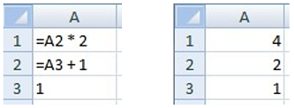

# M语言

## 写在前面

这一章节的内容完全来自于官方文档，官方的中文文档不太好，我看得很费劲，所以直接看的英文文档，看完后优化了官方中文文档，有些地方加了一些自己的备注。建议有能力直接看官方的英文文档。  

## 简单介绍

### 概述

Microsoft Power Query包含了许多强大的功能,来增强“数据获取”上的体验。它的核心功能是筛选和合并，也称为“mash-up”（混聚），即可以从多种类型的数据源中，提取一个或多个数据合集，并将他们混合汇聚，转换成统一格式，可供后续流程使用的数据。整个数据的的mashup过程，都使用了Power Query 公式语言（通常也称为“M”）。 Power Query 在 Excel 和 Power BI 中嵌入 M 文档，以完成数据的自动化可重复mashup。  
  
本文将介绍 M 语言的规范。我们会通过以下渐进式的步骤逐一介绍每一个块内容：  

1. 词法结构（lexical structure）：  
2. 基础结构的基本概念:值,表达式,环境,变量,标识符,计算模型。  
3. 值（包括基元值和结构化值）的详细规范,这种规范也定义了语言的目标域。  
4. 类型：值具有类型，而类型本身也是一种特殊的值，他们构成了各种值的基本原理并且他们本身携带的元数据信息又可以指明结构化值的形态。  
5. 运算符: M语言中的运算符决定了可以形成哪种形式的表达式。
6. 错误: 运算法或者函数,在表达式的计算过程中，可能会出现错误。虽然错误不是值，但可以通过多种方法将错误映射回值来处理错误。
7. Let: let表达式可以引入辅助定义，以便在更小的步骤中生成复杂的表达式。
8. 函数: 另一种特殊值，为 M 提供丰富标准库的基础，并允许添加新抽象 。
9. 条件语句: 表达式支持条件计算。
10. 分区： 节提供简单的模块化机制 。 （Power Query 尚未使用节。）
11. 合并语法：  

在本章中会简单地介绍以下各个部分的概念以便帮助大家有一个直观的任何和了解，在之后的章节中会更加具体地介绍每块内容。  
如果你是一位经验丰富的程序语言使用者，那么你可以把M语言理解成一种纯粹、高阶、动态类型、部分惰性的函数式编程语言。“the formula language specified in this document is a mostly pure, higher-order, dynamically typed, partially lazy functional language.”  

### 表达式和值  

M语言的核心结构是表达式。通过一个可计算的表达式，来产生一个值。  
尽管许多值都可以按字面形式写成表达式，但值不是表达式。例如，表达式 1 的计算结果为值 1；表达式 1+1 的计算结果为值 2。这个区别非常微妙，但是很重要。表达式是计算的方法；值是计算的结果。  
下面的示例演示了 M 中可用的不同类型的值。通常，使用字面意思直接编写的值，他们可以作为表达式使用，表达式的计算结果就是它本身。 （请注意，// 指示注释的开头，注释延续至行尾。）  

* 原始值（primitive value）是一个单一的值，比如数字，逻辑值，文本或者null。null用来表明数据不存在  

````M
123                  // A number
true                 // A logical
"abc"                // A text
null                 // null value
````

* 列表（list）值是值的有序序列 。 M 支持无限列表，但如果写入的是文本，则列表具有固定长度。 花括号 { 和 } 表示列表的开头和结尾。  

````M
{123, true, "A"}     // list containing a number, a logical, and a text 
{1, 2, 3}            // list of three numbers
````

* 记录（record）是一组字段。字段是名称/值对，其中名称是在字段的记录中唯一的文本值。记录值的文本语法允许将名称写成不带引号的形式，这种形式也称为“标识符”(identifiers)。下面显示了一个记录，其中包含名为 A、B和 C 的三个字段，这些字段具有值 1、2 和 3。  

````M
[
      A = 1,  
      B = 2,  
      C = 3
]
````

* 表(table)是一组按列（按名称标识）和行组织的值。没有用于创建表的字面量语法，但有几个标准函数可用于从列表或记录创建表。  

````M
#table( {"A", "B"}, { {1, 2}, {3, 4} } )
````

这将创建一个形状如下所示的表：  

A | B
---|---
1 | 2
3 | 4
5 | 6

* 函数（function）是一个值，当带着参数进行调用时，将生成一个新值。函数编写的方法是在括号中列出函数的“参数”，后跟箭头符号 => 和定义函数的表达式。该表达式通常引用参数（按参数名称引用）。  

````M
(x, y) => (x + y) / 2
````

### 计算  

在电子表格中，计算的先后顺序是根据单元格中公式的依赖关系来决定的，而M语言的计算模型就是根据表格中的这种计算模型演化而来。  
如果你有excel表格的公式编辑经验，你可能会意识到左侧的公式在计算时会生成右侧的值：  
  
  
在M语言中,表达式中的各个部分都可以通过名字来引用表达式的其他部分，整个计算过程将会根据被引用的表达式的计算结果自动决定计算顺序。  
  
我们可以使用一个记录来生成一个与上述电子表格示例等效的表达式。 初始化字段的值时，可以通过使用字段名称引用记录中的其他字段，如下所示：  

````M
[  
    A1 = A2 * 2,  
    A2 = A3 + 1,  
    A3 = 1  
]
````  

上述表达式等效于以下表达式（因为两者都计算出相等的值）：  

````M
[  
    A1 = 4,  
    A2 = 2,  
    A3 = 1  
]
````  

记录可以包含在其他记录中，也可以嵌套在其他记录中 。 我们可以使用“查找运算符” ([]) 按名称访问记录的字段。 例如，以下记录具有一个名为 Sales 的字段（包含一个记录）和一个名为 Total 的字段（用于访问 Sales 记录的 FirstHalf 和 SecondHalf 字段）：  

```M
[  
    Sales = [ FirstHalf = 1000, SecondHalf = 1100 ],
    Total = Sales[FirstHalf] + Sales[SecondHalf]
]
```
  
计算后，上述表达式等效于以下表达式：  

```M
[  
    Sales = [ FirstHalf = 1000, SecondHalf = 1100 ],
    Total = 2100
]
```  

!> 记录是一组key/value组合,我们通过记录的名称和key来找到对应的值  

记录也可以包含在列表中。 我们可以使用“位置索引运算符” ({}) 按其数字索引访问列表中的项目。 从列表的开头开始，使用从零开始的索引来引用列表中的值。 例如，索引 0 和 1 用于引用下面列表中的第一和第二项：  

```M
[
    Sales =  
        {  
            [  
                Year = 2007,  
                FirstHalf = 1000,  
                SecondHalf = 1100,
                Total = FirstHalf + SecondHalf // 2100
            ],
            [  
                Year = 2008,  
                FirstHalf = 1200,  
                SecondHalf = 1300,
                Total = FirstHalf + SecondHalf // 2500
            ]  
        },
    TotalSales = Sales{0}[Total] + Sales{1}[Total] // 4600
]
```

!> {}表示列表,要访问列表中的元素使用索引,列表的索引编号是从0开始的,即访问列表的第一个元素,是{0}  

列表和记录中的成员的表达式（以及后面引入的 let 表达式）使用“延迟计算(lazy evaluation)”进行计算，这意味着它们只会根据需要进行计算。所有其他表达式都使用“迫切计算(eager evaluation)”进行计算，这意味着如果在计算过程中遇到它们，则将立即对其进行计算。考虑这一点的一种好方法是记住计算列表或记录表达式将返回一个列表或记录值，该值本身会记住在请求时（查找或索引运算符）需如何计算其列表项或记录字段。  

!> let包裹的内容,以及列表和记录表中表达式,都是延迟计算,在没被调用之前,只是记录了表达式的内容,不会去计算表达式的值,只有在被其他"迫切计算"表达式调用时才会使用表达式去计算值。  
比如let包括的内容只有在使用in的时候会调用计算let里的内容。  

### 函数  

在 M 中，函数的做用是将一组输入值映射到单个输出值。 函数的编写方法是，首先命名所需的一组输入值（函数的参数），然后在“转到”(=>) 符号后面提供表达式,该表达式使用这些输入值（函数的主体）来计算函数的结果。 例如：  

```M
(x) => x + 1                    // function that adds one to a value
(x, y) =>  x + y                // function that adds two values
```

函数是一个值，就像数字或文本值一样。 以下示例演示一个函数，展示了其作为字段Add的一个值,而后被其他几个字段调用或者执行。调用函数时，将指定一组值，这些值会在逻辑上替换函数正文表达式中所需的输入值。  

```M
[
    Add = (x, y) => x + y,
    OnePlusOne = Add(1, 1),     // 2
    OnePlusTwo = Add(1, 2)      // 3
]
```

### 库

M包含了一组已经定义好的标准库，可以在表达式中直接使用，简称为库。这些定义由一组固定名称的值组成。库里这些固定名称的值可以在表达式中直接使用，无需在表达式中明确声明。比如：  

```M
Number.E                        // Euler's number e (2.7182...)
Text.PositionOf("Hello", "ll")  // 2
```

### 运算符  

M包含了一组运算符，可以在表达式中使用。将运算符运用于操作对象即形成符号表达式。比如，在表达式 “1 + 2”中，数字“1”和“2”是操作对象，“+”是相加运算法。  
运算符的含义可以根据操作对象的类型而变化。 例如，加号运算符可用于数字以外的值类型：  

```M
1 + 2                   // numeric addition: 3
#time(12,23,0) + #duration(0,0,2,0) // time arithmetic: #time(12,25,0)
```

另一个根据操作对象不同而代表不同含义的运算符示例是连接运算符 (&)：  

```M
"A" & "BC"              // text concatenation: "ABC"
{1} & {2, 3}            // list concatenation: {1, 2, 3}
[ a = 1 ] & [ b = 2 ]   // record merge: [ a = 1, b = 2 ]
```

请注意，运算符不一定支持某些值的连接。 例如： 

```M
1 + "2"  // error: adding number and text is not supported
```

### 元数据

我们可以将一个值与另一个值进行关联,把这种关联信息存储起来,存储这种关联信息的数据就称为元数据。元数据会被表现为一条记录，称为元数据记录。元数据记录中的字段可以用来存储一条值的元数据。  
每一个值都有元数据记录，如果一条数据没有指定元数据记录，那么它的元数据记录就是空。  
元数据记录提供了一种非介入式的方法将附加信息关联到任何值上面。将元数据记录与值相关联不会更改该值或其行为。  
使用语法 x meta y 表示将元数据记录值 y 与现有的值 x 相关联。例如，以下将带有 Rating 和 Tags 字段的元数据记录与文本值 "Mozart" 相关联：  

```M
"Mozart" meta [ Rating = 5, Tags = {"Classical"} ]
```

对于已经包含非空元数据记录的值，应用 meta 的结果是计算现有和新的元数据记录的记录合并的结果。 例如，下面两个表达式是等价的：  

```M
("Mozart" meta [ Rating = 5 ]) meta [ Tags = {"Classical"} ] 
"Mozart" meta ([ Rating = 5 ] & [ Tags = {"Classical"} ])
```

可以使用 Value.Metadata 函数访问一个给定值的元数据记录。 在下面的示例中，ComposerRating 字段中的表达式访问 Composer 字段中值的元数据记录，然后访问元数据记录的 Rating 字段。  

```M
[ 
    Composer = "Mozart" meta [ Rating = 5, Tags = {"Classical"} ], 
    ComposerRating = Value.Metadata(Composer)[Rating] // 5
]
```

### Let表达式  

目前为止展示的很多示例,都是一个结果表达式中包含了所有文本表达式（一行里面有一串的表达式组合）。 “let”表达式允许一组值进行计算、分配名称，然后在“in”后面的后续表达式中使用 。 例如，在我们的销售数据示例中，可以执行以下操作：  

```M
let 
    Sales2007 =  
        [  
            Year = 2007,  
            FirstHalf = 1000,  
            SecondHalf = 1100, 
            Total = FirstHalf + SecondHalf // 2100 
        ], 
    Sales2008 =  
        [  
            Year = 2008,  
            FirstHalf = 1200,  
            SecondHalf = 1300, 
            Total = FirstHalf + SecondHalf // 2500 
        ] 
  in Sales2007[Total] + Sales2008[Total] // 4600
```

上述表达式的结果是一个数字值 (4600)，该值是根据绑定到名称 Sales2007 和 Sales2008 的值计算得出的。

### If表达式

if 表达式根据两个表达式的逻辑结果进行选择。 例如：

```M
if 2 > 1 then
    2 + 2
else  
    1 + 1
```

如果逻辑表达式 (2 > 1) 为 true，则选择第一个表达式 (2 + 2)；如果为 false，则选择第二个表达式 (1 + 1)。 将对选定的表达式（在本例中为 2 + 2）进行计算，并成为 if 表达式 (4) 的结果。  

### 错误  

一个错误表示一个表达式的过程无法产生值。  
错误是由运算符和函数遇到错误情况，或使用了错误表达式导致的。可以使用 try 表达式来处理错误。引发某一错误时，会指向引起这个错误的值，此值可用于指示错误发生的原因。  

```M
let Sales = 
    [ 
        Revenue = 2000, 
        Units = 1000, 
        UnitPrice = if Units = 0 then error "No Units"
                    else Revenue / Units 
    ],
    UnitPrice = try Number.ToText(Sales[UnitPrice])
in "Unit Price: " &
    (if UnitPrice[HasError] then UnitPrice[Error][Message]
    else UnitPrice[Value])
```

上面的示例访问 Sales[UnitPrice] 字段,对值进行格式化并产生结果：  

```M
"Unit Price: 2"
```

如果 Units 字段为零，UnitPrice 字段会引发错误，而 try 表达式则会处理此错误。 结果值将为：  

```M
"No Units"
```

try 表达式将正确的值和错误转换为一个记录值，这条记录可以值指示 try 表达式是否处理了错误，以及在处理错误时是否返回相对应的正确处理结果和错误处理结果。 例如，请考虑以下引发错误，然后立即进行处理的表达式：  

```M
try error "negative unit count"
```

上面的表达式计算结果为以下嵌套的记录值。这也解释了之前单价示例中的 [HasError]、[Error] 和 [Message] 字段为什么可以直接使用。  

```M
[ 
    HasError = true, 
    Error = 
        [ 
            Reason = "Expression.Error", 
            Message = "negative unit count", 
            Detail = null 
        ] 
]
```

!> 当使用try时会自动创建一条记录,你可以直接访问try表达式中的字段。单价示例中try Number.ToText(Sales[UnitPrice])的结果是  
```M
//WHEN uNITS = 1000
[ 
    HasError = false,
    Value = 2
]

//WHEN uNITS = 0
[ 
    HasError = true, 
    Error = 
        [ 
            Reason = "Expression.Error", 
            Message = "No Units", 
            Detail = null 
        ] 
]
```

处理错误常见的方式是使用默认值替换错误。 try 表达式可以与一个可选的 otherwise 子句一起使用，从而以紧凑的形式实现：  

```M
try error "negative unit count" otherwise 42
// 42 当错误发生时,返回42
// if true then "value" else 42  
```

## 词法结构(Lexical Structure)  

## 基本概念  

### 值(value)  

单个数据称为_值(value)_。 广义上讲，有两个常规类别的值：基元值和结构化值。前者是值的最基本形式(atomic)，后者由基元值和其他结构化值构成。 例如，值  

```M
1 
true
3.14159 
"abc"
```

是基元，因为它们不由其他值构成。 但是，值  

```M
{1, 2, 3} 
[ A = {1}, B = {2}, C = {3} ]
```

是使用基元值进行构造的，在这条记录中，是使用其他结构化值构造的。  

### 表达式(expression)  

_表达式_是用于构造值的公式。 表达式可以使用多种语法结构形成。 下面是一些表达式示例。 每一行都是一个单独的表达式。

```M
"Hello World"             // a text value 
123                       // a number 
1 + 2                     // sum of two numbers 
{1, 2, 3}                 // a list of three numbers 
[ x = 1, y = 2 + 3 ]      // a record containing two fields: 
                          //        x and y 
(x, y) => x + y           // a function that computes a sum 
if 2 > 1 then 2 else 1    // a conditional expression 
let x = 1 + 1  in x * 2   // a let expression 
error "A"                 // error with message "A"
```

如上所示，最简单的表达式形式，字面量本身就是值。  
更复杂的表达式由其他表达式（称为 sub-expressions）组成。 例如：  

```M
1 + 2
```

上面的例子实际上又3个表达式组成，字面值_1_和_2_是表达式_1+2_的子表达式。  
在表达式中执行由句法结构定义好的算法，称为_计算_表达式。每种类型的表达式都具有其计算规则。 例如，字面量表达式（如 1）将生成一个常数值，而表达式 a + b 将通过计算其他两个表达式（a 和 b）来获取生成的值，并根据一组规则将它们相加。  

### 环境和变量

## 值(value)   

## 类型

## 运算符  

## Let  

### Let表达式(expression)

一个let表达式可以用来获取变量的中间计算结果的值。  

let-expression:  
&nbsp;&nbsp;&nbsp;&nbsp;let variable-list in expression  
variable-list:  
&nbsp;&nbsp;&nbsp;&nbsp;variable  
&nbsp;&nbsp;&nbsp;&nbsp;variable , variable-list  
variable:  
&nbsp;&nbsp;&nbsp;&nbsp;variable-name = expression  
variable-name:  
&nbsp;&nbsp;&nbsp;&nbsp;identifier  

下面的示例显示要计算的中间结果，这些结果存储在变量 x、y 和 z 中，以供在后续计算 x + y + z 中使用：  

```M
let     x = 1 + 1,
        y = 2 + 2,     
        z = y + 1 
in
        x + y + z
```  

此表达式的结果为：  

```M
11  // (1 + 1) + (2 + 2) + (2 + 2 + 1)
```  

在计算 let-expression 中的表达式时，存在以下情况：  
* 变量列表中的表达式定义了一个新的作用域，其中包含来自 variable-list 产生式的标识符，并且在计算 variable-list 产生式中的表达式时必须存在 。 variable-list 中的表达式可能相互引用。
* 在计算 let-expression 中的表达式之前，必须先计算 variable-list 中的表达式。
* 除非使用了 variable-list 中的表达式，否则不能对其进行计算。
* 传播在计算 let-expression 中的表达式期间引发的错误。
let 表达式可以看作是隐式记录表达式的语法糖。下面的表达式与上面的表达式等效：  

```M
[     x = 1 + 1,
      y = 2 + 2,
      z = y + 1,
      result = x + y + z 
][result]
```

## 条件语句  

## 函数

## 错误处理

M语言表达式的计算，只会产生两种输出结果：  

* 生成单个值。
* 生成错误信息，来表明表达式在计算的过程中无法产生一个值。一个错误包含了一个记录，这条记录里的内容可提供更详细的信息来表明是什么导致计算无法完成。

可以在表达式内部产生错误，也可以在表达式内部直接处理错误。

### 引发错误

引发错误语法：  
error-raising-expression:  
&nbsp;&nbsp;&nbsp;&nbsp;error expression

文本值可作为错误表达式的简写形式：  

```M
error "Hello, world" // error with message "Hello, world"
```

完整的错误值是一条记录，可以用Error.Record来构造这条记录：  

```M
error Error.Record("FileNotFound", "File my.txt not found","my.txt")
```

上面的表达式等价于：  

```M
error [ 
    Reason = "FileNotFound", 
    Message = "File my.txt not found", 
    Detail = "my.txt" 
]
```

!> 直接使用文本的时候，实际上是记录了error的message为那个文本  

引发一个错误，将导致当前在计算的表达式停止，此时与这个错误关联的表达式都会展开，直到：  

* 错误信息传播到了记录中的一个字段、分区中的一个成员、let内的一个变量，这里统称为条目，错误信息会被一起保存在那个条目里，然后扩散。对该条目的任何后续访问都将导致引发相同的错误。 记录、节或 let 表达式的其他条目不一定会受到影响（除非它们访问之前标记为有错误的条目）。  
* 已达到顶级表达式。 在这种情况下，计算顶级表达式的结果是一个错误而不是一个值。  
* 已达到 try 表达式。 在这种情况下，将捕获错误并以值的形式返回。  

### 处理错误  

处理错误的语法：  
error-handling-expression:  
&nbsp;&nbsp;&nbsp;&nbsp;try protected-expression otherwise-clauseopt  
protected-expression:  
&nbsp;&nbsp;&nbsp;&nbsp;expression  
otherwise-clause:  
&nbsp;&nbsp;&nbsp;&nbsp;otherwise default-expression  
default-expression:  
&nbsp;&nbsp;&nbsp;&nbsp;expression  

在不使用_otherwise-clause_情况下，有可能出现以下几种情况：  

* 如果_protected-expression_的计算结果不会引发错误，并且产生了值x，那么_error-handling-expression_产生的结果是一条如下形式的记录：  

```M
[ HasErrors = false, Value = x ]
```

* 如果_protected-expression_的计算结果引发了错误，并且产生了错误值e，那么_error-handling-expression_产生的结果是一条如下形式的记录：  

```M
[ HasErrors = true, Error = e ]
```

在使用_otherwise-clause_情况下，有可能出现以下几种情况：  

* 必须在_otherwise-clause_之前计算_protected-expression_。  
* 当且仅当计算 protectedexpression 引发错误时，才必须计算_otherwise-clause_。
* 如果在计算 protectedexpression 引发错误，_otherwise-clause_计算出来的结果就是最终的_error-handling-expression_的结果  
* 在计算_otherwise-clause_的时所产生的错误会扩散  

下面的示例演示了在没有引发错误的情况下的 error-handling-expression：  

```M
let
    x = try "A"
in
    if x[HasError] then x[Error] else x[Value] 
// "A"
```

下面的示例演示了引发错误，然后对其进行处理：  

```M
let
    x = try error "A" 
in
    if x[HasError] then x[Error] else x[Value] 
// [ Reason = "Expression.Error", Message = "A", Detail = null ]
```

try表达式处理产生的错误结果可由otherwise来替代：  

```M
try error "A" otherwise 1 
// 1
```

如果 otherwise 子句也引发错误，那么整个 try 表达式也会引发错误：  

```M
try error "A" otherwise error "B" 
// error with message "B"
```

### 初始化记录和let时的错误

下面的示例显示了一个记录初始值设定项，其中字段 A 引发错误，并且由两个其他字段 B 和 C 访问。 字段 B 不处理 A 引发的错误，但是 C 会处理此错误。 最终字段 D 不访问 A，因此不受 A 中的错误影响。  

```M
[ 
    A = error "A", 
    B = A + 1,
    C = let x =
            try A in
                if not x[HasError] then x[Value]
                else x[Error], 
    D = 1 + 1 
]
```

计算以上表达式的结果是：

```M
[ 
    A = // error with message "A" 
    B = // error with message "A" 
    C = "A", 
    D = 2 
]
```
M 中的错误处理应在接近错误原因的位置执行，以处理惰性字段初始化以及延迟闭包计算的影响。下面这个例子展示了尝试使用try进行错误处理时，最终并没有得到想要的错误处理结果。  

```M
let
    f = (x) => [ a = error "bad", b = x ],
    g = try f(42) otherwise 123
in 
    g[a]  // error "bad"
```

在此示例中，定义 g 用于处理调用 f 时引发的错误。 但是，错误发生在一个由程序初始化的字段中，那么只有在这个初始化字段被调用时，才会引发错误。因此函数f产生的记录_[ a = error "bad", b = 42 ]_，直接传递给了try，由于a没有被调用，因此try的结果是么有error，直接返回了这条记录。  
当最终访问a，即g[a]时，才引发了错误。  

### 不执行的错误  

当编写表达式的时候，作者可能会希望忽略表达式的部分内容不去执行，但是仍然希望表达式的其他部分可以正常执行。一种方法是当执行进入这部分不想被执行的部分时，引发一个错误。比如：  

```M
(x, y) =>
     if x > y then
         x - y
     else
         error Error.Record("Expression.Error", 
            "Not Implemented")
```

省略号（...）可用作error的快捷方式。  

not-implemented-expression:
&nbsp;&nbsp;&nbsp;&nbsp;...  

例如，下面的示例等效于前面的示例：  

```M
(x, y) => if x > y then x - y else ...
```  

## 分区  

## 合并语法
